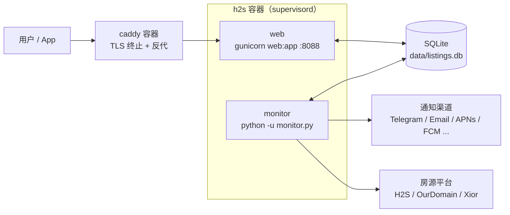
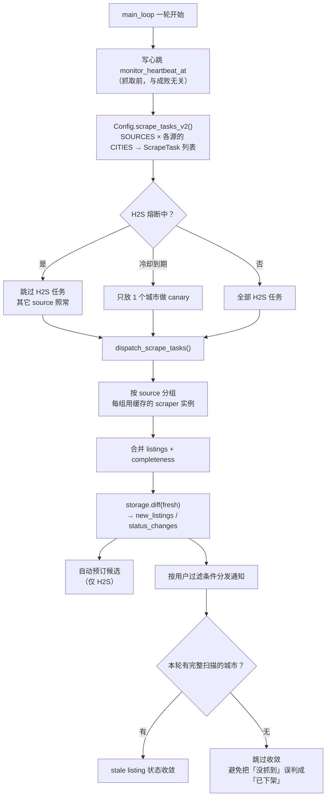

# FlatRadar 架构说明

面向要自部署、排障或改代码的人。读完你应该能回答：进程怎么跑、一轮抓取
经过哪些环节、状态存在哪、出问题时系统怎么反应。

用户向的使用说明在 [flatradar.app/guide](https://flatradar.app/guide)，
接口契约在 [API.md](API.md)，各平台的抓取侦察在 [XIOR.md](XIOR.md) /
[OURDOMAIN.md](OURDOMAIN.md) / [SCRAPING_RECON.md](SCRAPING_RECON.md)。

---

## 1. 进程模型

一个容器里由 supervisord 带起两个**互相独立**的进程，另一个容器跑 Caddy 反代：



两个进程**只通过 SQLite 通信**，没有 IPC。这带来两个后果：

- web 挂了不影响抓取，monitor 挂了不影响面板浏览——但**面板会显示旧数据而不报错**。
- 因此 `/health` 必须同时检查两者。历史教训见 §5.1。

进程定义在 [`docker/supervisord.conf`](../docker/supervisord.conf)。两者都
`autostart=true`，所以容器重建会让被手动停掉的 monitor 自动恢复。

---

## 2. 一轮抓取

主循环在 [`monitor.py`](../monitor.py) 的 `main_loop()`，每轮调用 `run_once()`。



### 轮询节奏

间隔不是固定值，由 [`mcore/interval.py`](../mcore/interval.py) 决定：

| 因素 | 效果 |
|---|---|
| 高峰时段（默认工作日 8:30–10:00、13:30–15:00 荷兰时间） | 用 `PEAK_INTERVAL`，默认 60s |
| 非高峰 | 用 `CHECK_INTERVAL`，默认 300s |
| 自适应 | 连续成功时高峰间隔逐步收紧 5%，下限 `MIN_INTERVAL` |
| 抖动 | 每轮 ±`JITTER_RATIO`（默认 20%），避免固定周期特征 |

### 任务粒度

`ScrapeTask` 是 `(source, city_key, city_display)` 三元组，定义在
[`scrapers/base.py`](../scrapers/base.py)。一个城市 / 一栋楼 = 一个 task。
`SOURCES=holland2stay,ourdomain,xior` 且各源配了城市时，一轮就是多个 task
混合派发——某个 source 全挂不影响其它 source 的结果入库。

---

## 3. 抓取层

```
scrapers/
├── base.py           AbstractScraper / ScrapeTask / ScrapeResult / 异常定义
├── __init__.py       SCRAPER_REGISTRY + get_scraper() + dispatch_scrape_tasks()
├── holland2stay.py   GraphQL over 浏览器传输层
├── ourdomain.py      RENTCafe HTML/AJAX over curl_cffi
└── xior.py           WordPress admin-ajax over 浏览器传输层
```

三个源的传输方式不同，因为它们的反爬强度不同：

| Source | 传输 | 为什么 |
|---|---|---|
| Holland2Stay | 浏览器（CloakBrowser） | GraphQL 端点在 Cloudflare 托管挑战后面，TLS 指纹伪装过不去 |
| Xior | 浏览器（CloakBrowser） | 同上，2026-08-02 起 AJAX 端点也上了挑战 |
| OurDomain | curl_cffi + TLS 指纹轮换 | 目前只有 WAF 级 403，换指纹即可通过 |

> **`get_scraper()` 返回的是缓存实例，不是新对象。** 浏览器挂在实例上，每次
> 新建实例会让跨轮复用彻底失效。见 §5.4。

### 3.1 浏览器传输层

[`browser_fetcher.py`](../browser_fetcher.py) 把「过 Cloudflare 挑战 → 拿到
clearance → 发同源请求」抽象成站点无关的流程，站点差异收在 `SiteProfile`：

```python
XIOR_PROFILE = SiteProfile(
    name="Xior",
    challenge_url="https://www.xiorstudenthousing.eu/netherlands/",
    default_headers=_XIOR_AJAX_HEADERS,
)
```

| 字段 | 作用 |
|---|---|
| `challenge_url` | 过挑战时导航的页面。**它决定了同源请求的 origin**，必须与后续请求同域 |
| `default_headers` | 该站点请求的默认头 |
| `clearance_probe` | 可选。初始化最后一步用它确认 clearance 生效；没有就跳过 |
| `clearance_pending_markers` | 403 响应里出现这些 = clearance 未生效（可恢复），而非 IP 被封 |
| `maintenance_check` | 可选钩子，只在挑战解开后调用 |

**关键：请求必须在浏览器内发出**（`page.evaluate` 里的 `fetch`），不能把
cookie 搬给 HTTP 客户端——Cloudflare 的 clearance 同时绑定 TLS 指纹，脱离
浏览器就失效。

---

## 4. 状态

全部在一个 SQLite 文件 `data/listings.db`（Docker 里挂 volume，重建不丢）。

| 表 | 内容 |
|---|---|
| `listings` | 房源当前快照，主键是平台内的 listing id |
| `status_changes` | 状态变更流水 |
| `meta` | 键值对：心跳、维护态、最后抓取时间等 |
| `user_configs` | 用户、过滤条件、通知渠道、加密后的凭据 |
| `web_notifications` | 面板内通知（支持 per-user） |
| `device_tokens` / `app_tokens` | APNs / FCM 设备与 App 登录令牌 |
| `geocode_cache` | 地址 → 坐标缓存，避免重复请求 |

几个常用的 `meta` 键：

| 键 | 含义 |
|---|---|
| `monitor_heartbeat_at` | 每轮**开始时**刷新，`/health` 据此判断 monitor 是否还活着 |
| `last_scrape_at` | 最后一次**成功抓取**。与心跳不同，熔断期间不刷新 |
| `upstream_maintenance_seen_at` | 首次探测到平台维护的时间 |

> `monitor_heartbeat_at` 和 `last_scrape_at` 回答的是两个问题：「循环还在转吗」
> 和「抓到数据了吗」。健康检查必须用前者——H2S 熔断冷却最长 4 小时，那期间没有
> 成功抓取，但系统完全健康。

---

## 5. 失败处理

这一节是本文档最该读的部分。以下每一条都对应过一次真实故障。

### 5.1 健康检查必须覆盖 monitor

2026-06-13 至 08-02，monitor 被停了 **7 周**，容器全程报 `healthy`，39 份用户
配置没收到任何通知，也没有任何告警——因为 `/health` 当时只检查 web 能否响应。

现在 `/health` 用**心跳新鲜度**判定，超过 `MONITOR_HEARTBEAT_MAX_AGE`（默认
900s ≈ 3–4 轮）返回 503。用心跳而不是 PID，是因为进程还在但循环卡死时 PID 检查
看不出来。

注意：**unhealthy 不会自动重启**。`restart: unless-stopped` 只在容器退出时触发。
这个机制让停摆可见，要变成告警仍需外部监控订阅容器健康状态。

### 5.2 Cloudflare 挑战的可靠判据

判断挑战是否通过，**唯一可靠的信号是 HTML 里挑战脚本的 `_cf_chl_opt` 是否消失**。
以下都试过，都会误判：

| 候选信号 | 为什么不行 |
|---|---|
| `challenges.cloudflare.com` | 挑战解开后的真实页面里同样存在（CSP 头 + 站点自带 turnstile） |
| `/cdn-cgi/challenge-platform/` | 同上 |
| URL 里的 `__cf_chl_rt_tk` | CF 靠 `history.replaceState` 回写，时机不定；挑战早已解开时仍可能残留 |
| DOM 元素（如 `[data-cy="FilterList-item"]`） | 与能否发请求无关。实测 GraphQL 已经 200 时该元素仍未渲染 |

最后一条造成过 7 周停摆：旧代码用它当判据，**超时后只打一条 warning 就继续，并把
会话标记为已初始化**，于是挑战没过也照发请求，必然 403 → 重建 → 崩溃 → 熔断。

### 5.3 挑战通过 ≠ 可以发请求

`_cf_chl_opt` 消失只说明文档被真实页面替换了，`cf_clearance` cookie 未必已经生效。
实测两者之间有约 2 秒空窗，这期间请求返回 `403 {"code":"clearance_required"}`。

**clearance 过期只能靠重新导航恢复**——token 是页面通过挑战时下发的，对着 API
轮询永远换不出新 token，只会白等到超时再误判成屏蔽。

耗时差异很大，超时上限要按最慢环境取：

| 环境 | 挑战耗时 |
|---|---|
| macOS 本地 | 约 2–3s |
| 1 CPU 生产 VPS | 10–35s |

### 5.4 浏览器必须跨轮复用

每轮重建浏览器 = 每轮一次完整 CF 挑战。数据中心 IP 被这样挑战十几次/小时后，
Cloudflare 会升级挑战难度，表现为挑战耗时越来越长直至超时熔断。

复用需要**两个条件同时成立**，缺一个就静默退化：

1. `get_scraper()` 缓存实例——浏览器挂在实例上。
2. H2S/Xior 的抓取跑在**进程级长存**的单线程 executor 里
   （`monitor._get_h2s_executor()`）。Playwright 对象绑定创建线程，线程一换
   浏览器即作废。

v1.9.0 声称实现了跨轮复用，但这两条都不满足，实际从未生效。

### 5.5 source 级熔断

H2S 连续抓取失败会触发熔断，**只暂停 H2S**，其它 source 继续。冷却到期后先用
1 个城市做 canary，成功才恢复完整扫描。

因此只启用一个 source 时，这套设计等于空转——H2S 一熔断，整轮变成空操作。

### 5.6 「屏蔽」「维护」「限流」要分开

三者都可能是 4xx，但处置完全不同：

| 异常 | 触发 | 处置 |
|---|---|---|
| `BlockedError` | CF 屏蔽、clearance 无法恢复 | source 熔断 + admin 告警 |
| `UpstreamMaintenanceError` | 平台维护页 | 安静冷却，**不打扰普通用户**（他们什么也做不了） |
| `RateLimitError` | 429 | 退避重试 |
| `ScrapeNetworkError` | 网络 / 超时 / 非预期响应 | 本轮标记 incomplete |

维护异常曾被 403 处理分支压成 `BlockedError`，导致平台维护走了熔断 + 告警路径。

### 5.7 completeness 决定能否做状态收敛

`ScrapeResult.complete` 表示「这个城市这一轮抓全了」。只有完整扫描过的城市才会
执行 stale listing 收敛（把不再出现的房源标为已下架）。

**上游返回空要区分「真没房」和「查询失败」。** Xior 的 WordPress 端点在向 Yardi
取可用性失败时仍返回 `success=true` + `units=[]`，真实错误只在
`availability_response.errorCode` 里——不查这个字段就会把上游故障读成零可用。
其中 `errorCode: 204` 是例外，它就是「当前无可用单元」的正常表达（用官方前端
对照验证过）。

---

## 6. 通知

`monitor` 拿到 `new_listings` / `status_changes` 后，**逐用户**判断：先过该用户的
过滤条件，再分发到他启用的渠道。渠道实现在 [`notifier.py`](../notifier.py) 和
[`notifier_channels/`](../notifier_channels/)。

永久性失败要与临时故障分开。例：用户拉黑 Telegram bot 后每次都回
`403 bot was blocked by the user`，这个状态不会自愈——现在会停止重试并自动关闭该
用户的 Telegram 渠道（保留凭据，解除拉黑后重新勾选即可），同时写一条面板通知
说明原因。

---

## 7. 自动预订

仅 Holland2Stay 可用。流程：`CreateEmptyCart → AddNewBooking →
SetPaymentMethodOnCart → GetCheckoutAgreements → PlaceOrder → IdealCheckOut`，
**停在支付 URL，不完成支付**。

为降低延迟，本轮确实有候选时会提前为对应用户预登录（prewarm）。

OurDomain 和 Xior 的 RENTCafe 预订引擎（[`bookers/rentcafe.py`](../bookers/rentcafe.py)）
框架已完成，但多步表单的剩余步骤尚未侦察，面板标记为「开发中」。

---

## 8. 排障入口

| 现象 | 先看 |
|---|---|
| 没有任何新房源通知 | `/health` 是否 200；`supervisorctl status` 里 monitor 是否 RUNNING |
| 日志刷 `H2S source 熔断` | §5.5；检查出口 IP 是否被 CF 盯上，考虑配 `HTTPS_PROXY` |
| 日志刷 `CF 挑战 90s 内未解开` | §5.3；多为 IP 信誉问题，换出口 IP |
| 某平台一直 0 条 | §5.7；确认是真没房还是上游查询失败 |
| 容器内存接近上限 | 每个浏览器常驻约 200–400MB，多 source 时需 2G |

常用命令：

```bash
# supervisor 的 socket 不在默认路径，必须带 -c
docker exec h2s supervisorctl -c /etc/supervisor/conf.d/app.conf status

# 健康状态（含心跳年龄）
docker exec h2s python -c "import urllib.request as u; \
  print(u.build_opener(u.ProxyHandler({})).open('http://localhost:8088/health').read())"

# 部署前预检
python -m tools.doctor --no-network
```

---

## 9. 已知限制

- 三个 source 是**不同的房源池**，不构成互为冗余。H2S 挂掉时仍然拿不到 H2S 房源。
- 单机 SQLite，没有水平扩展设计；`--workers=1` 是为了避免写锁冲突。
- Cloudflare 策略随时可能变化，抓取层的稳定性本质上依赖出口 IP 的信誉。
- 自动预订只覆盖 H2S，且未在真实账号上跑通完整下单验证。
