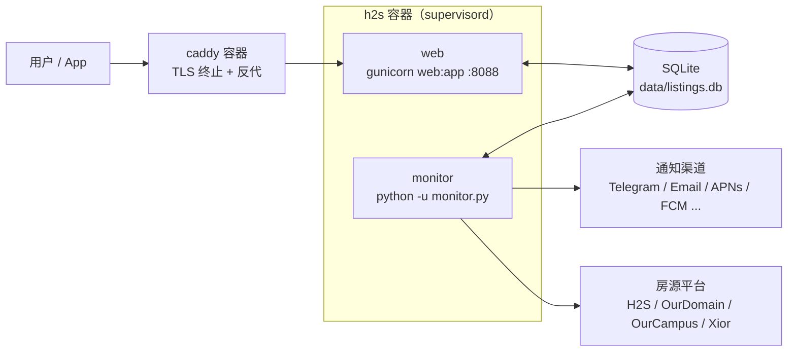
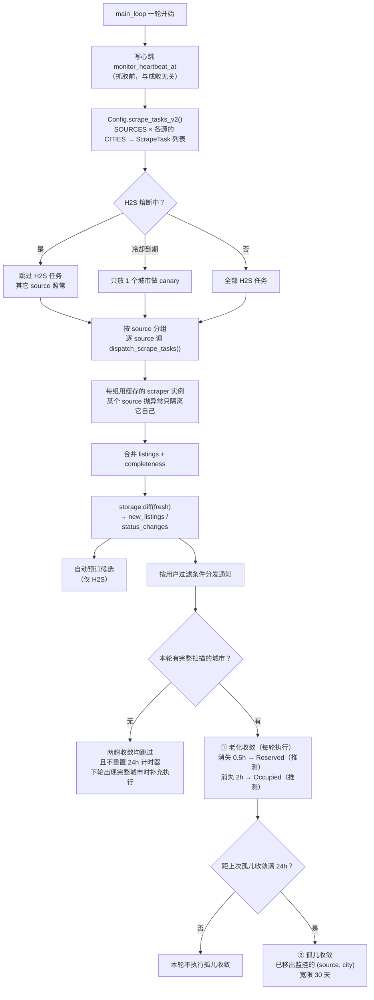
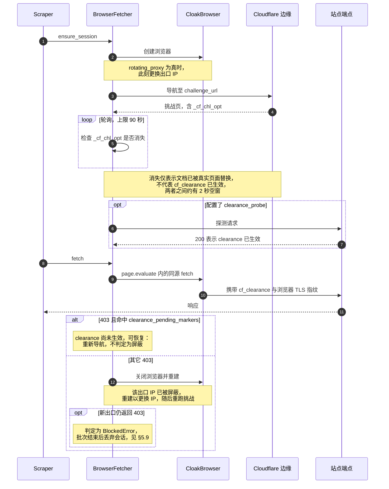
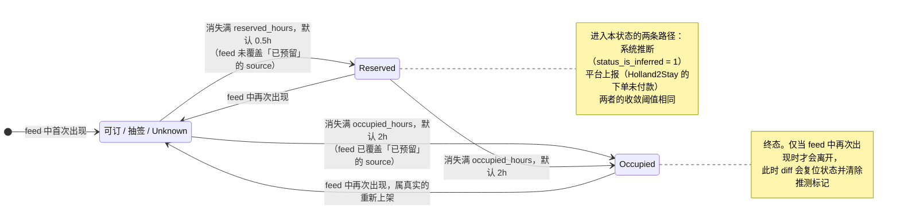
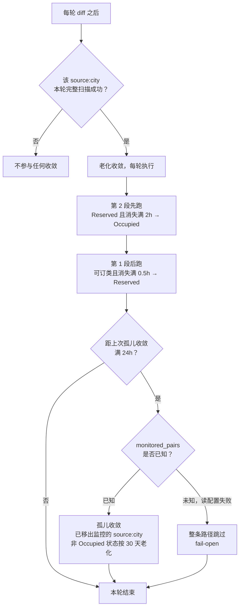
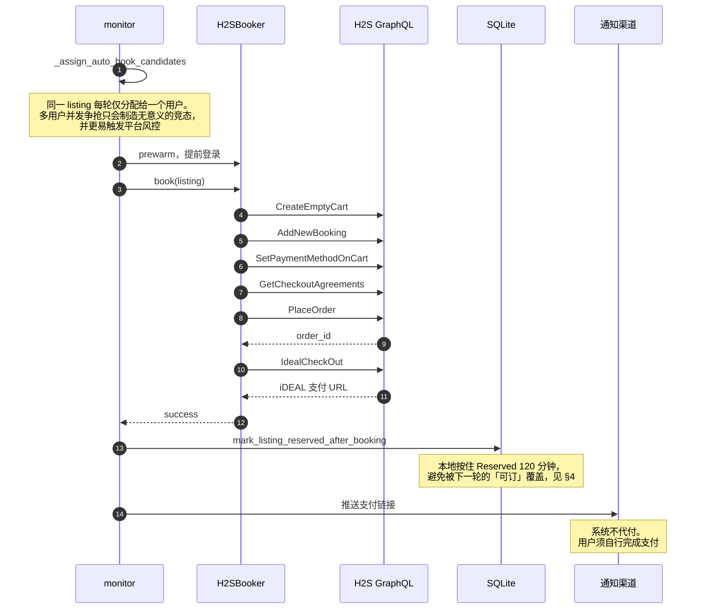

# FlatRadar 架构说明

本文档面向自部署、排障与二次开发者。阅读之后应能回答以下问题：进程如何运行、
单轮抓取经过哪些环节、状态保存在哪里、发生故障时系统如何响应。

面向用户的使用说明见 [flatradar.app/guide](https://flatradar.app/guide)，接口契约
见 [API.md](API.md)，各平台的抓取侦察见 [H2S.md](H2S.md) /
[XIOR.md](XIOR.md) / [OURDOMAIN.md](OURDOMAIN.md) / [SCRAPING_RECON.md](SCRAPING_RECON.md)。

---

## 1. 进程模型

一个容器内由 supervisord 启动两个**互相独立**的进程，另一个容器运行 Caddy 反向
代理：



两个进程**仅通过 SQLite 通信**，不存在 IPC。由此产生两个后果：

- web 故障不影响抓取，monitor 故障不影响面板浏览——但**面板会显示陈旧数据而不
  报错**。
- 因此 `/health` 必须同时检查两者，相关教训见 §5.1。

进程定义位于 [`docker/supervisord.conf`](../docker/supervisord.conf)。两者均为
`autostart=true`，因此重建容器会使此前被手动停止的 monitor 自动恢复。

### 1.1 配置按生命周期分为四类，存放位置随之不同

系统级配置的键分属四种生命周期，登记于 [`env_registry.py`](../env_registry.py)，
该文件是键名的唯一权威清单：

| 类别 | 数量 | 谁改 | 存放位置 |
|---|---|---|---|
| `secret` | 19 | 人，部署时一次 | `.env`。不进数据库——库会被备份、导出、下载 |
| `deploy` | 9 | 人，换机器或换域名时 | `.env`。部分须在能读数据库**之前**可用，`DB_PATH` 即是 |
| `runtime` | 20 | **Web 面板，运行时** | SQLite `app_settings` |
| `tuning` | 30 | 几乎无人改动 | `.env`，均有代码默认值，多数部署一个都不必填 |

`runtime` 一类原先与其余三类同处 `.env`，构成本设计中的矛盾：该文件同时充当
「人手写的部署产物」与「程序运行时写入的存储」。双重身份在代码中留下两处代价——
[`app/env_writer.py`](../app/env_writer.py) 为多 worker 并发写入加锁；
`config.write_env_key()` 无法使用 `dotenv.set_key()`，因其内部的 `os.replace()`
会破坏 Docker 的 bind mount。

> 一般规律：**一份配置若同时被人和程序写入，就无法同时保持可手改、可 diff、可追溯。**
> 判断依据不是键的数量，而是写入者的数量。

#### 取值顺序与迁移

```
真实环境变量  >  app_settings 表  >  代码默认值
```

实现方式是**注水**（[`settings_store.py`](../settings_store.py)）：启动时把表中的值
写入 `os.environ`，但仅限环境中尚不存在的键。各模块数十处
`os.environ.get(key, default)` 因而无需改动，顺序自动成立。环境变量一层予以保留，
用于容器化排障时的强制覆盖（`docker compose run -e CHECK_INTERVAL=30 ...`）。

保留强制覆盖的代价是它**不可见**：面板显示一个值，进程使用另一个。因此
`source_of()` 如实报告每个键的来源，面板据此显示「被环境变量覆盖，在此修改不会
生效」，`monitor` 启动时亦对 `.env` 中残留的 `runtime` 键发出 WARNING。

首次启动执行一次性迁移：将 `.env` 中的 `runtime` 键写入 `app_settings`，随后
**从 `.env` 移除**（移除前整份备份为 `.env.bak.<时间戳>`）。移除是必需的而非清理
——`.env` 经 `load_dotenv()` 进入 `os.environ`，只要键还在文件里就永远优先于数据库，
面板保存将「成功」但无任何效果。

同理，迁移还须将这些键从**内存中的** `os.environ` 撤除：`config` 模块导入时已执行
过 `load_dotenv()`，仅删文件不足以生效，否则首次升级后的整个进程周期内面板均为失效
状态。此点由 `tests/test_settings_store.py::test_panel_edit_takes_effect_after_rehydrate`
固定。

写入路径为单一事务（`set_app_settings`），并附带 `updated_at` / `updated_by`；
迁移写入的记录标记为 `migration`，面板写入的标记为 `panel`。

#### 结构化配置的解析边界

监控范围（`CITIES` / `*_CITIES` / `AVAILABILITY_FILTERS` / `SHARD_SIZES` /
`SOURCE_MIN_INTERVALS` / `SOURCES`）本质是表格数据，实际以带分隔符的字符串存放。
2026-08-06 实测表明，同一层的输入错误此前后果并不一致：

| 输入 | 原行为 |
|---|---|
| `CITIES=Eindhoven`（缺 ID） | 静默丢弃 → 0 个城市，监控照常运行且不抓取任何房源 |
| `CITIES=Eindhoven;29` | 同上 |
| `CITIES=Eindhoven,abc` | `ValueError`，monitor 无法启动 |
| `AVAILABILITY_FILTERS=…,999999` | 全部接受，抓取一个不存在的状态 |
| `SOURCES=holland2stay,xiorr` | 全部接受，一个不存在的平台 |

其中第一种最难察觉：**空列表本身是合法配置**（「不监控任何城市」），因此下游无处
报错——该故障与「确实不想监控」在语义上不可区分，只有解析层能够分辨。

解析集中于 [`target_config.py`](../target_config.py)，统一返回 `(结果, 问题清单)`，
不提供「静默丢弃一项」的路径。校验分两层，处置不同：

| 层次 | 判据 | 处置 |
|---|---|---|
| 格式 | 分隔符、字段数、数值类型 | 致命；面板拒绝保存 |
| 实体 | ID / 平台名是否在已知表内 | 警告；照常保存 |

实体层不设为致命系有意为之：官方注册表会更新，写死拒绝将使一个新上线的城市变成
保存失败乃至启动失败。

校验挂载于两处：面板保存**之前**（坏值不入库，整批一起拒绝），以及 `monitor` 启动
时的自检（值仍可能来自手工改库、迁移或环境变量覆盖）。自检打 ERROR 但**不阻断启动**
——单个配置笔误导致整体停摆，代价高于笔误本身，且多数问题只影响一个平台。

#### 键名审计

`monitor.py` 启动时据 registry 审计 `.env`，未登记的键发 WARNING 并给出最接近的
候选（`PEAK_STRAT` → `PEAK_START`）。此前键名拼错是**完全静默**的——不报错，只是
安静地走默认值。审计只告警不阻断启动。

三方一致性（代码实际读取 ↔ registry ↔ `.env.example`）由
`tests/test_env_registry.py` 固定。其源码扫描按当前存在的读取形态匹配
（`os.environ.get` / `os.environ[...]` / `_env_int` / `_env_float` / `_read`，以及
`*_ENV` 常量持有键名）；**新增包装函数须同步加入扫描器**，否则该测试会静默漏判
而非报错。此限制记录于测试的 docstring 中。

---

## 2. 一轮抓取

主循环位于 [`monitor.py`](../monitor.py) 的 `main_loop()`，每轮调用 `run_once()`。



两趟收敛的节奏不同，系有意设计：老化的阈值为**小时级**，若挂在 24 小时的计时器
上，阈值的调整将失去意义——满 2 小时本应判定终态的房源，最坏需滞留 26 小时。
孤儿收敛的宽限期为 30 天，每 24 小时执行一次已足够。阈值本身即为节流机制：已到
终态的行会被 `WHERE` 排除，稳态下老化每轮命中 0 行。详见 §5.13。

### 轮询节奏

轮询间隔并非固定值，由 [`mcore/interval.py`](../mcore/interval.py) 决定：

| 因素 | 效果 |
|---|---|
| 高峰时段（默认工作日 8:30–10:00、13:30–15:00 荷兰时间） | 采用 `PEAK_INTERVAL`，默认 60s |
| 非高峰时段 | 采用 `CHECK_INTERVAL`，默认 300s |
| 自适应 | 连续成功时高峰间隔逐步收紧 5%，下限为 `MIN_INTERVAL` |
| 抖动 | 每轮 ±`JITTER_RATIO`（默认 20%），以避免呈现固定周期特征 |

### 任务粒度

`ScrapeTask` 是 `(source, city_key, city_display)` 三元组，定义于
[`scrapers/base.py`](../scrapers/base.py)。一个城市或一栋楼对应一个 task。当
`SOURCES=holland2stay,ourdomain,xior` 且各源均配置了城市时，单轮即为多个 task 的
混合派发。monitor **按 source 分组、逐组调用 dispatcher**，某个 source 整体失败
不影响其余 source 的结果入库——该隔离是显式实现的，并非自动成立，见 §5.8。

多源同轮时，completeness 的 key 带 `source:` 前缀（`holland2stay:Eindhoven`），
单源部署下退化为裸城市名。该前缀决定了 stale 收敛能否按 (source, city) 精确限定。

---

## 3. 抓取层

```
scrapers/
├── base.py           AbstractScraper / ScrapeTask / ScrapeResult / 异常定义
├── __init__.py       SCRAPER_REGISTRY + get_scraper() + dispatch_scrape_tasks()
├── _browser_backed.py BrowserBackedScraper：浏览器型 source 的共同基类，
│                     承载创建 / 存活性检查 / 年龄重建 / 批次会话的生命周期
├── holland2stay.py   GraphQL over 浏览器传输层
├── ourdomain.py      RENTCafe HTML/AJAX over curl_cffi
├── ourcampus.py      继承 OurDomain，只换取单元表的请求形状
└── xior.py           WordPress admin-ajax over 浏览器传输层
```

各源的传输方式不同，取决于其反爬强度：

| Source | 传输方式 | 原因 |
|---|---|---|
| Holland2Stay | 浏览器（CloakBrowser） | GraphQL 端点位于 Cloudflare 托管挑战之后，TLS 指纹伪装无法通过 |
| Xior | 浏览器（CloakBrowser） | 同上；自 2026-08-02 起 AJAX 端点亦启用了挑战 |
| OurDomain | curl_cffi + TLS 指纹轮换 | 目前仅有 WAF 级 403，更换指纹即可通过 |
| OurCampus | 同 OurDomain | 同属 Greystar，使用同一套 RentCafe/SecureRC 后端 |

> **`get_scraper()` 返回的是缓存实例，而非新对象。** 浏览器实例挂载在 scraper
> 实例上，每次新建实例都会使跨轮复用完全失效，见 §5.4。

### 3.1 浏览器传输层

[`browser_fetcher.py`](../browser_fetcher.py) 将「通过 Cloudflare 挑战 → 取得
clearance → 发起同源请求」抽象为与站点无关的流程，站点差异收敛到 `SiteProfile`：

```python
XIOR_PROFILE = SiteProfile(
    name="Xior",
    source="xior",                    # 取该源专属的代理 session
    challenge_url="https://www.xiorstudenthousing.eu/netherlands/",
    default_headers=_XIOR_AJAX_HEADERS,
    rotating_proxy=True,              # 重建浏览器 = 换出口 IP
)
```

| 字段 | 作用 |
|---|---|
| `challenge_url` | 通过挑战时导航的页面。**它决定了同源请求的 origin**，必须与后续请求同域 |
| `default_headers` | 该站点请求的默认请求头 |
| `clearance_probe` | 可选。初始化的最后一步据此确认 clearance 已生效；未提供则跳过 |
| `clearance_pending_markers` | 403 响应中出现这些标记，表示 clearance 尚未生效（可恢复），而非 IP 被封禁 |
| `maintenance_check` | 可选钩子，仅在挑战通过后调用（挑战页由 Cloudflare 生成，通过之前的正文与站点状态无关） |
| `source` | 该 profile 所属的 source，决定使用哪条代理 sticky session |
| `rotating_proxy` | 为 `True` 时每次创建浏览器均更换 session（即更换出口 IP）。适用于**按 IP 累积限流**的站点：单个浏览器会话内 IP 保持稳定，因此 clearance 仍可复用。它同时是 403 与挑战超时的恢复前提——参见本节末尾 |

**请求由浏览器内部发出**（`page.evaluate` 中的 `fetch`）。此处曾长期记载「不能
将 cookie 转交 HTTP 客户端——clearance 同时绑定 TLS 指纹，脱离浏览器即失效」，
2026-08-05 实测该结论不成立，但据此改造的方向同样不可行，两点均记录于此。

**cookie 确实可以搬出去。** 浏览器通过一次挑战后导出 `cf_clearance` 与 UA，交由
curl_cffi 携带、走同一出口 IP，GraphQL 返回 200（chrome131 / chrome136 / chrome124
三种指纹均可）。不带 cookie 直接请求则为 403 `Just a moment...`——API 与网页同处
一道 Cloudflare 门后。curl_cffi 的 Chrome 指纹伪装已足够接近，TLS 不再构成障碍。

**但据此改造省不了流量，反而更费。** 同日以 `tools/clearance_probe.py` 实测一张票
离开浏览器后的寿命：

| 存活 | 结果 |
|---|---|
| 0 / 5 / 10 / 15 分钟 | 200 |
| 20 / 25 / 30 分钟 | 403 `Just a moment...` |

真实寿命 15–20 分钟。`cf_clearance` 上标称的一年为摆设；真正生效的是同域下的
`h2s_clr`，其过期时间恰为 0.5 小时。

而浏览器内的会话可维持 2 小时（`_BROWSER_MAX_AGE`），因为它持续发出正常请求、
cookie 由服务端不断刷新；票一旦离开浏览器便无人续期。改用 curl_cffi 之后，**通过
挑战的频率只会上升**——由 2 小时一次变为 15–20 分钟一次。

> 一般规律：**否定结果与肯定结果同样需要记录。** 只写下「cookie 搬不出去」而未说明
> 依据，后来者会重新验证并发现它可行，随即投入一次注定失败的改造；此处两项结论
> 并存，才能真正终止该方向。

挑战载荷（2026-08-04：985 MB 中 558 MB）只能通过**减少浏览器重建次数**来降低，即
持久化 profile（§3.4）与放宽重建周期。更换出口 IP 必须重新通过挑战，此点不受影响。

完整时序如下。其中的判据与超时取值分别见 §5.2 与 §5.3：



**两类 403 的处置方式相反**：`clearance_pending_markers` 命中者为瞬时状态，
重新导航即可恢复，更换 IP 反而会丢弃已有会话；其余 403 表示当前出口 IP 已被
屏蔽，在同一浏览器上重跑挑战无法改变出口，必须重建浏览器。挑战超时与
clearance 超时同属后者，因此 `ensure_initialized()` 的每次重试均在新出口上
进行——三次尝试若共用一个 IP，等同于将同一次失败重复三遍。

重建仅对 `rotating_proxy` 为 `True` 的 profile 有意义；固定 session 的 profile
重建后得到的是同一出口，只会额外付出一次冷启动开销。

### 3.2 代理故障的识别

Chromium 在代理层失败时一律返回 `ERR_TUNNEL_CONNECTION_FAILED` 一类的错误码，
不透出代理给出的状态码。配额耗尽（402）、认证失败（407）与代理进程宕机在
Playwright 层完全无法区分，若一概归因于 Cloudflare 挑战，排查方向将被误导。

导航失败命中代理错误码时，`_describe_navigation_failure()` 会调用
[`config.probe_proxy()`](../config.py) 向**该浏览器实际使用的那条代理线路**发送
一次 `CONNECT`，取回代理自身的状态码并写入日志：

| 状态码 | 含义 |
|---|---|
| 402 | 流量配额耗尽或账户欠费 |
| 403 | 该出口被代理商禁用 |
| 407 | 代理认证失败 |
| 429 | 代理侧限流 |
| 502 / 503 | 代理无法连接目标站点 / 代理服务不可用 |

探测须使用浏览器实际使用的代理 URL。对 `rotating_proxy` 的 profile 重新调用
`get_proxy_url()` 会得到另一条 session，探测到的是其它出口，结论无效。凭据仅用于
构造 `Proxy-Authorization` 请求头，不进入返回值与日志。

### 3.3 资源拦截

代理按流量计费，而浏览器为通过挑战会加载完整页面，其中包含图片、字体、统计脚本
与广告——这些与房源数据无关。2026-08-04 全天代理侧记录：985 MB 中约 97 MB 属于
此类。抓取实际需要的只有 DOM 与 `cf_clearance` cookie。

`_should_block()` 按两条规则判定，命中即 `route.abort()`：

| 规则 | 内容 |
|---|---|
| 按资源类型 | `image` / `media` / `font` |
| 按域名 | 统计、广告、客服挂件、字体 CDN、地理编码等第三方域 |

三类**始终放行**：

- `challenges.cloudflare.com` 与 `cloudflareinsights.com`（含全部子域）——挑战依赖
  它们，且后者流量极小，拦截收益不足以抵消会话显得不完整的风险；
- `stylesheet` 与 `script`——Cloudflare 的行为检测会读取渲染结果，移除样式表或脚本
  等同于改变页面呈现，而这两类合计不足 5 MB；
- `cdn.jsdelivr.net`——站点自身的业务 bundle 亦经由该 CDN 分发，无法按域名区分。

域名匹配须按点边界进行（`host == d or host.endswith("." + d)`）。子串匹配会将
`nottrustpilot.com` 一类误判；而按点边界匹配又会漏掉 `cdn-cookieyes.com` 这种
**独立注册域**——它并非 `cookieyes.com` 的子域，须单独列出。

判定异常时一律放行：拦截是节流优化，而非抓取的前提。`route` 处理器抛出异常会使该
请求悬挂至超时，代价高于多下载一次。`page.route()` 安装失败同样仅告警，不影响启动。

`BROWSER_BLOCK_RESOURCES=0` 可整体关闭。拦截改变了页面的加载行为，需要保留一条
无需发布新版本即可退回原状的路径。每个浏览器会话结束时会记录本次拦截的请求数，
用于确认规则仍然生效。

### 3.4 持久化 profile

代理流量中占比最大的一项是 Cloudflare 的挑战载荷（2026-08-04：985 MB 中 558 MB，
56.6%），成因是每次重建浏览器均使用全新的空缓存，Turnstile 的 JS 与 WASM 无法
沿用。Xior 的浏览器每 15 分钟重建一次，是该项的主要来源。

**仅指定 `--disk-cache-dir` 无效。** `launch()` 配合 `new_page()` 使用的是 incognito
context，其 HTTP 缓存仅存在于内存中，浏览器关闭即丢弃；实测缓存目录中只会留下
若干索引文件，传输字节数没有变化。必须改用 `launch_persistent_context()`。

本地实测（2026-08-05，Holland2Stay 首页）：

| | 传输字节 | 磁盘缓存命中 | 页面 |
|---|---:|---:|---|
| 冷 profile | 3.93 MB | 3 个请求 | 正常渲染 |
| 暖 profile | 0.25 MB | 143 个请求 | 正常渲染 |

**cookie 每次启动均清空。** clearance 绑定出口 IP，而 `rotating_proxy` 意味着下次
创建浏览器时出口多半已经改变；携带上一个 IP 的 `cf_clearance` 发起请求，只会被
Cloudflare 判定为可疑并重新挑战。需要复用的仅是磁盘缓存中的静态资源。

**并发由槽位文件锁保证。** 一个 profile 目录同一时刻只能被一个 Chromium 打开，而
Holland2Stay 的 scraper 与 booker 共用同一个 source 且运行在不同线程。
`_acquire_profile_slot()` 依次尝试 `<source>-0` … `<source>-N`，以 `flock` 独占其
`.lock` 文件；锁必须持有至浏览器关闭之后才释放，提前释放会使另一线程在 Chromium
尚未退出时取得同一目录。槽位全部占用时退回临时 profile——节流不应以取不到浏览器
为代价。

**启动前须清理 Chromium 的单实例锁。** 容器 `force-recreate` 时旧 Chromium 是被
杀掉的，`SingletonLock` / `SingletonSocket` / `SingletonCookie` 会留在 bind mount
中，其内容为指向 `<容器 hostname>-<pid>` 的符号链接。新容器 hostname 已变、pid 亦
不存在，Chromium 据此判定 profile 正被占用并立即退出，Playwright 报
`Target page, context or browser has been closed`。由于失败仅静默降级为临时
profile，其表现是**每次部署之后节流效果悄然消失**。

清理是安全的：同一时刻仅有一个实例使用该目录，已由槽位 flock 保证，Chromium 这层
锁对本项目属冗余。判断须使用 `lstat()` 而非 `exists()`——这些是悬空符号链接，
`exists()` 会跟随链接返回 `False`，导致一个也删不掉。

profile 位于 `<DATA_DIR>/browser_profiles/`，每槽位磁盘缓存上限 128 MB
（`--disk-cache-size`）。删除该目录不影响正确性，仅损失一次冷启动。
`BROWSER_PERSIST_PROFILE=0` 可整体关闭。

> 持久化 profile 与 §5.11 的「403 时重建浏览器换 IP」并不冲突：重建仍复用同一个
> profile 目录，因此换 IP 的代价从「重下全部资源」降为「重解一次挑战」。

---

## 4. 状态

全部状态存放于单个 SQLite 文件 `data/listings.db`（Docker 部署下挂载为 volume，
重建容器不会丢失）。

| 表 | 内容 |
|---|---|
| `listings` | 房源当前快照，主键为平台内的 listing id。`status_is_inferred` / `status_hold_until` 两列见下文 |
| `status_changes` | 状态变更流水 |
| `meta` | 键值对：心跳、维护状态、最后抓取时间等 |
| `user_configs` | 用户、过滤条件、通知渠道及加密后的凭据 |
| `web_notifications` | 面板内通知（支持按用户区分） |
| `device_tokens` / `app_tokens` | APNs / FCM 设备令牌与 App 登录令牌。`device_tokens.os_version` 可空——低于 iOS 2.1.0 的客户端与当前的 Android 客户端不上报，NULL 表示「未上报」而非「未知版本」，见 `docs/API.md` |
| `geocode_cache` | 地址至坐标的缓存，用于避免重复请求 |
| `round_stats` | 每轮每 source 一行的抓取遥测，保留 30 天（见 §5.12） |

`listings` 中有三列并非抓取所得，而是由系统写入，需单独说明：

| 列 | 写入方 | 语义 |
|---|---|---|
| `status_is_inferred` | `mark_stale_listings()` 置 1；`diff()` 收到真实数据时置 0 | 表示该行的 `status` 系**系统推断**而非平台上报。面板、API 与移动端均会暴露该字段（`Listing.status_is_inferred`；面板上表现为状态旁的「推测」徽标），使用户始终可区分状态的来源 |
| `status_hold_until` | `mark_listing_reserved_after_booking()` | 自动预订下单成功后，本地将状态保持为 `Reserved` 的截止时间，默认 120 分钟（`BOOKING_STATUS_HOLD_MINUTES`，对齐 Holland2Stay 的付款限时）。上游 feed 未必立即反映刚提交的订单，若不保持则会被下一轮的「可订」覆盖，并额外产生一条失实的重新上架通知。保持的条件为三项同时成立：状态为**推断的** `Reserved`、feed 上报「可订」、尚未到期；任一项不成立时一律以 feed 为准 |
| `city_normalized` | `diff()` 写入；`_backfill_city_normalized()` 于每次启动刷新 | 归一后的城市名，供全部城市筛选使用。原始 `city` 保留并照常展示，见 §4.1 |

### 4.1 `city` 在四个平台上不是同一种东西

| Source | `city` 实际存放的内容 |
|---|---|
| Holland2Stay | 城市名 —— `Eindhoven` / `Rotterdam` / `Utrecht` |
| Xior | **楼盘名** —— `Utrecht Willem Dreeslaan` / `Amsterdam Naritaweg` |
| OurDomain | **楼盘名** —— `Amsterdam Diemen` / `Amsterdam South-East` |
| OurCampus | **楼盘名** —— `OurCampus Amsterdam Diemen` |

而 `ListingFilter.allowed_cities` 是精确匹配。两者相加的结果是：勾选「Utrecht」
的用户既看不到、也收不到 Xior 位于 Utrecht 的房源。2026-08-05 核查生产库，14 个
用户处于该状态，累计 56 条房源——数据已入库、平台已勾选、抓取一切正常，面板上
不存在任何异常迹象。**该判据同时决定是否发送通知**，因此其影响不限于浏览页面。

现由 `config.canonical_city()` 归一，`city_normalized` 落库，筛选走归一值，原始
`city` 仅用于展示。三点需要注意：

**归一表是显式的，不做前缀解析。** `Aachen Vaals Katzensprung` 所属城市为
`Aachen Vaals` 而非 `Aachen`，按前缀推断必然出错；而推断错误会把房源归入一个并不
存在的城市，其后果比不归一更严重。Xior 的 `KNOWN_XIOR_CITIES` 原本即含 `city` /
`bldg` 两个字段，直接取用；OurDomain 与 OurCampus 补充了 `city`。未收录的值原样
返回。

**两侧都要归一。** 仅归一房源侧，则存量配置中保存着楼盘名的用户会立即失效；仅归
一用户侧则等同于未修复。回填在每次启动时执行，而非仅在建列当次——楼盘归属写在
config 中，调整之后存量行必须随之更新。

**查询使用 `COALESCE(NULLIF(city_normalized,''), city)` 而非直接读取归一列。**
若今后有写入路径遗漏该列，对应房源将从全部城市筛选中消失，且既不报错也不告警；
退回原始 `city` 至少可按其字面值检索。索引相应建为表达式索引。

Diemen 行政上为独立市镇，此处归入 Amsterdam：平台按 Amsterdam 对外销售，用户亦按
Amsterdam 检索。调整归属只需修改 config 中的一处。

> 一般规律：**同名字段在不同数据源里未必是同一个概念。** 合并多来源数据时，
> 真正的风险不是字段缺失——缺失会立刻暴露——而是字段存在、类型相同、语义不同。

### 4.2 feature 取值的归一与匹配

Holland2Stay 的 feature 取值有荷兰语与英语两版，返回哪一版取决于房源录入时的
语言，与房源本身无关。同一批数据中 `Two (only couples)` 与
`Twee (alleen koppels)` 并存，筛选按字面匹配即会漏。

`models.FEATURE_SYNONYMS` 收录两版的对应关系，`canonical_feature()` 完成归一。
**两侧都须归一**：仅归一房源侧会使存量配置中保存着荷兰语原文的用户立即失效，
仅归一用户侧则等同于未处理。下拉选项经 `get_feature_values()` 按归一值去重，
因此界面上只呈现规范写法。

`config.whitelist_matches()` 是唯一的匹配入口，通知路径（`ListingFilter.passes`）
与浏览页（`feature_contains`）共用。此前二者各有一套实现，其结果并不一致——
2026-08-05 修复通知侧之后，浏览页仍按旧规则返回 251 条（含 Semi / Fully /
Unfurnished），而通知只发出 187 条。

**统一取值匹配尚不足够，平台适用范围亦须一致。** 上述修复完成后线上仍有恒定
83 条的差异：通知侧对不提供该维度的平台整体跳过该条件（fail-open），浏览页则因
「没有该字段即不匹配」而将其排除，83 正是缺少 `Finishing` 字段的房源数
（Xior 66 + OurDomain 17）。浏览页现经 `dim_applies()` 采用同一语义。

放行是正确的：这两家的房源实际均带家具，只是 feed 不上报该属性；按「缺字段即
不匹配」处理，等同于因上游少给一个字段就将整个平台从结果中抹去。

匹配方式按维度查 `_EXACT_MATCH_DIMS` 决定：

| 方式 | 适用维度 | 理由 |
|---|---|---|
| 整体相等 | `finishing` | 四档装修程度互斥。裸子串会使 `Furnished` 命中 `Unfurnished`——含义正相反 |
| 词边界 | 其余全部 | 跨平台措辞不同：房型在 H2S 记为 `1`，在 OurDomain 记为 `1-Bedroom Apartment` |

维度名须作为参数传入，而非传布尔量。写成布尔量时该表可被清空而行为不变，表随即
退化为装饰性注释——修改它不产生任何效果，读到它的人却会以为有效。

装修四档的定义见 Holland2Stay 官方说明：`Unfurnished` 无地板灯具家具；
`Semi furnished` 有地板、灯具、窗帘及厨卫电器，无家具；`Furnished` 增加床、桌、
椅、衣柜；`Fully furnished` 再增加餐具、锅具与清洁用品。`Furnished` 与
`Fully furnished` 的分界在于「入住当日是否还需采购厨具与床品」，因此二者不合并。

**展示侧同样归一，但仅限受控取值的类目**（`_NORMALIZED_CATEGORIES`）。同义表按
整个值查表，扫过自由文本会误伤——片区或楼盘若恰好名为 `Kaal`，将被改写为
`Unfurnished`。归一只作用于展示副本，数据库中的原始值保持不变。

### 4.3 过滤维度的平台适用范围

平台不支持某维度时，该条件对其**整体跳过**（fail-open，见 §3 的能力表）。该行为
本身正确——否则一套条件会将整批未提供该属性的房源误杀——但此前界面未作任何说明：
设置「能耗 ≥ A」的用户会认为收到的均为 A 级，而 Xior 的房源实际未经过该项校验。

`sources_supporting_dim()` / `dim_scope_note()` / `dim_scope_badge()` 将能力表暴露
至界面。房源列表页在标签旁显示 `仅 Holland2Stay` 徽标，完整说明置于 tooltip；用户
表单在筛选区顶部完整陈述一次规则，各字段同样只留徽标——逐字段各写一遍会使同一句话
在单页中出现八次，其中六次完全相同。

措辞须明确「其余平台的房源**不受该条件影响**」。仅写「仅对 X 生效」会被理解为
「其余平台将被排除」，其含义恰好相反。

常用的 `meta` 键：

| 键 | 含义 |
|---|---|
| `monitor_heartbeat_at` | 每轮**开始时**刷新，`/health` 据此判断 monitor 是否仍在运行 |
| `last_scrape_at` | 最后一次**成功抓取**的时间。与心跳不同，熔断期间不刷新 |
| `upstream_maintenance_seen_at` | 首次探测到平台维护的时间 |
| `watchdog_active` / `watchdog_fired:*` | 退化告警的活跃集与节流时间戳（见 §5.12） |

> `monitor_heartbeat_at` 与 `last_scrape_at` 回答的是两个不同的问题：「循环是否
> 仍在运行」与「是否抓取到数据」。健康检查必须采用前者——Holland2Stay 的熔断冷却
> 最长 6 小时，其间没有成功抓取，但系统状态完全正常。
>
> 这两个键均为**标量**，每轮被覆盖，无法回答任何关于历史或分 source 的问题。
> 该类问题（例如「昨晚 Xior 为何只有 2/6」）由 `round_stats` 回答。

---

## 5. 失败处理

本节是全文最值得阅读的部分。以下每一条均对应一次真实发生过的故障。

### 5.1 健康检查必须覆盖 monitor

2026-06-13 至 08-02，monitor 被停了 **7 周**，容器全程报 `healthy`，所有用户都
没收到任何通知，也没有任何告警——因为 `/health` 当时只检查 web 能否响应。

现 `/health` 依据**心跳新鲜度**判定，超过 `MONITOR_HEARTBEAT_MAX_AGE`（默认
900s，约 3–4 轮）即返回 503。采用心跳而非 PID，是因为进程尚存但循环卡死时，PID
检查无法识别。

需注意：**unhealthy 不会触发自动重启**。`restart: unless-stopped` 仅在容器退出时
生效。该机制的作用是使停摆可见；若需转化为告警，仍需外部监控订阅容器健康状态。

### 5.2 Cloudflare 挑战的可靠判据

判断挑战是否通过，**唯一可靠的信号是 HTML 中挑战脚本的 `_cf_chl_opt` 是否消失**。
以下候选信号均经过试验，均会导致误判：

| 候选信号 | 不可用的原因 |
|---|---|
| `challenges.cloudflare.com` | 挑战通过后的真实页面中同样存在（CSP 头及站点自带的 turnstile） |
| `/cdn-cgi/challenge-platform/` | 同上 |
| URL 中的 `__cf_chl_rt_tk` | Cloudflare 通过 `history.replaceState` 回写，时机不确定；挑战早已通过时仍可能残留 |
| DOM 元素（如 `[data-cy="FilterList-item"]`） | 与能否发起请求无关。实测 GraphQL 已返回 200 时该元素仍未渲染 |

最后一条曾导致 7 周停摆：旧代码以其为判据，**超时后仅记录一条 warning 便继续执行，
并将会话标记为已初始化**，于是在挑战未通过的情况下照常发起请求，必然导致
403 → 重建 → 崩溃 → 熔断。

### 5.3 挑战通过 ≠ 可以发请求

`_cf_chl_opt` 消失仅表明文档已被真实页面替换，`cf_clearance` cookie 未必已经生效。
实测两者之间存在约 2 秒的空窗，其间请求返回 `403 {"code":"clearance_required"}`。

**clearance 失效只能通过重新导航恢复**——token 由页面通过挑战时下发，持续轮询
API 永远无法换取新 token，只会持续等待至超时并被误判为屏蔽。

各环境的耗时差异很大，超时上限应按最慢的环境取值：

| 环境 | 挑战耗时 |
|---|---|
| macOS 本地 | 约 2–3s |
| 1 CPU 生产 VPS | 10–35s |

### 5.4 浏览器必须跨轮复用

每轮重建浏览器意味着每轮都要完整通过一次 Cloudflare 挑战。数据中心 IP 在每小时
遭遇十余次此类挑战后，Cloudflare 会提升挑战难度，表现为挑战耗时持续增长直至超时
熔断。

跨轮复用需要**两个条件同时成立**，缺少任一条件都会静默退化：

1. `get_scraper()` 缓存实例——浏览器实例挂载于 scraper 实例之上。
2. 每个浏览器型 source 运行在**各自独立的**进程级长存单线程 executor 中
   （`monitor._get_browser_executor(source)`）。

第 2 条包含两层约束，二者缺一不可：Playwright 对象绑定其创建线程，线程一旦更换，
浏览器即失效，因此该线程的存活期必须长于单轮；此外，两个独立的 Playwright sync
实例**不能共存于同一线程**——第一个会在该线程上安装 event loop，第二个的
`launch()` 随即被判定为「在 asyncio loop 中使用同步 API」，因此 Holland2Stay 与
Xior 不能共用一条线程。

v1.9.0 声称实现了跨轮复用，但上述两条均未满足，实际从未生效；v1.9.9 修复第一层
时又一度将两个 source 置于同一线程，触发了第二层约束。

### 5.5 source 级熔断

每个 source 各持有一个独立的熔断器，实现于
[`mcore/circuit.py`](../mcore/circuit.py) 的 `SourceCircuits`。当某 source 的
任务整体失败、且异常类型落在该 source 的 `trips_on` 白名单内时触发熔断，
**仅暂停该 source**，其余 source 继续运行；冷却到期后先以 1 个 target 作 canary
试探，成功后方恢复完整扫描。连续失败则冷却翻倍，直至该 source 的上限。

冷却参数按 source 分别配置——各平台的失败语义并不相同，退避参数亦不应相同：

| Source | 触发熔断的异常 | 起始冷却 | 上限 |
|---|---|---|---|
| Holland2Stay | `BlockedError` | 30 分钟 | 6 小时 |
| Xior | `BlockedError` / `RateLimitError` | 10 分钟 | 1 小时 |
| 其余（默认） | `BlockedError` | 15 分钟 | 2 小时 |

Xior 将 429 纳入熔断，是因其限流按 IP 跨轮累积（见
[XIOR.md §2.2](XIOR.md)）：整源 429 之后若不退避，下一轮恰好在限流最严的时刻
再次施压。Holland2Stay 则不纳入——该平台的 429 由抓取层内部的
`RATE_LIMIT_BACKOFF` 消化即可，此为实测结论。

`ScrapeNetworkError` 一律不触发熔断。网络失败已有 main_loop 的连续失败计数与
冷却，叠加第二层退避会使恢复时机难以预测。

`trips_on` 采用白名单而非黑名单：新增一种异常时默认**不**熔断，较之默认熔断
更为安全。

若仅启用单个 source，熔断将失去隔离意义——该 source 一旦熔断，整轮即为空操作。

**该机制曾长期为 Holland2Stay 独有。** 抽象层是对称的（`AbstractScraper` 与
`SCRAPER_REGISTRY`），编排层却将 Holland2Stay 硬编码为特例——它曾是唯一的
source，这一历史遗留固化成了架构。其后果是保护恰好装在了最不需要它的那个
source 上。推广前对保留日志中「整体抓取失败」的全量统计如下：

| Source | 异常 | 次数 | 当时是否有熔断 |
|---|---|---|---|
| Xior | `RateLimitError` | 147 | 否 |
| OurDomain | `ScrapeNetworkError` | 67 | 否 |
| OurCampus | `ScrapeNetworkError` | 60 | 否 |
| Xior | `ScrapeNetworkError` | 57 | 否 |
| Holland2Stay | 全部合计 | 6 | 是 |

#### 5.5.1 退避状态必须落库

熔断截止时刻与连败计数、登录抑制、各类告警节流，原本均为 `monitor` 的模块级
全局变量，进程重启即清零。其代价是：正处于 6 小时退避中的 source，一次部署即
令其恢复满速施压；2026-08-20 当日部署 12 次，等同于 12 次退避清零，admin 亦于
每次部署后重收同一批告警。

该判断项目自身早已写下——`_apply_source_intervals` 的注释即为「时间戳存 meta，
重启后仍然生效，否则频繁重启会绕过节流，而重启往往正因出现故障」。同一判断、
同一文件，当时仅落实于「source 抓取间隔」一项。

现由 [`mcore/backoff.py`](../mcore/backoff.py) 的 `PersistedBackoff` 统一承载，
状态写入 `meta` 表。两个设计要点：

- **采用墙钟而非单调钟。** `monotonic()` 的零点是进程启动，持久化其取值并无
  意义。代价是须处理 NTP 跳变，处理方式为将剩余时间钳制至配置上限——等待时长
  永不超过该 source 配置的最长退避。若不钳制，一次时钟回跳足以令该 source 长期
  停摆，且无任何日志可供追溯成因。
- **`expire()` 与 `reset()` 语义分离。** `reset()` 表示问题已解决（canary
  成功），连败计数清零；`expire()` 表示本轮等待到期，计数保留。二者混同会使
  持续被封时每次退避均自起始值重新计算，永远无法逼近上限，而该上限正是用于
  保护出口 IP 的。

读取失败不视为致命：退避状态是优化而非抓取的前提，读不到最多退化为「本轮不
退避」，不应将 monitor 拦在启动阶段。

### 5.6 「屏蔽」「维护」「限流」要分开

三者均可能表现为 4xx，但处置方式完全不同：

| 异常 | 触发条件 | 处置 |
|---|---|---|
| `BlockedError` | Cloudflare 屏蔽、clearance 无法恢复 | source 熔断并向 admin 告警；批次结束后丢弃浏览器会话（§5.9） |
| `UpstreamMaintenanceError` | 平台维护页 | 静默冷却，**不打扰普通用户**（该情形下用户无可操作） |
| `OperationNotAllowedError` | 403，但正文为上游应用所述「该 operation 未登记」 | 隔离该 task，且**不**丢弃会话、**不**更换出口 IP——二者均属无效动作，须照抄站点原文 |
| `RateLimitError` | 429 | 先由抓取层退避重试；退避耗尽则短路同 source 的剩余 task（§5.6.1），并按该 source 的策略决定是否熔断（§5.5） |
| `ProxyError` | 代理层故障（`ScrapeNetworkError` 的子类） | 冷却该代理、切换备用，或降级为直连原生 IP（§5.15） |
| `ScrapeNetworkError` | 网络故障 / 超时 / 非预期响应 | 该 task 不计入 completeness（缺席不等于完整），连续失败达到阈值后方冷却 |

维护异常曾被 403 处理分支归并为 `BlockedError`，导致平台维护走上了熔断加告警的
路径。

#### 5.6.1 429 是 source 级状态，不是 task 级状态

`dispatch_scrape_tasks()` 原本将 `RateLimitError` 与 `BlockedError` 置于同一
`except` 分支，但仅为 403 设有 source 级处理（批次结束后丢弃会话），429 记入
`hard_failures` 后即继续下一个 task。

429 是服务端针对本客户端**出口 IP** 作出的配额判定，而非针对某一栋楼或某一个
城市。首个 task 在退避耗尽后仍被拒绝，即说明配额尚未恢复，其余 task 必然同样
被拒——区别仅在于每一个都要先睡满一整轮退避，去重新证明一件已知的事。

2026-08-20 生产日志（Xior，4 个城市）：

```
16:21:06  xior:Amsterdam Karspeldreef      429
16:22:37  xior:Amsterdam Naritaweg         429   +91s
16:24:08  xior:Eindhoven Kronehoefstraat   429   +91s
16:25:39  xior:Eindhoven Zernikestraat     429   +91s
```

整齐的 91 秒即 `RATE_LIMIT_BACKOFF` 的 30s 加 60s，单次爆发约 6 分钟。**该 6
分钟阻塞整轮**，同轮内其余 source 的房源随之延迟交付。此类爆发自 2026-08-10
起每日约 10 次，累计接近 1 小时的空转。

现改为：批次内一旦出现 429，同 source 的剩余 task 直接判定为失败，不再发出任何
请求。同一日改动后的首次爆发，四条记录落在同一毫秒内，熔断于 3 毫秒后跳闸。

三项**刻意未作改动**者：403 仍跑完整批、批次结束后方丢弃会话（§5.9）；429 仍
不丢弃会话（等待即可恢复，重建只是徒然多过一次 Cloudflare 挑战）；
`ScrapeNetworkError` 不短路——它是单次请求的抖动，而非配额判定。

### 5.7 completeness 决定能否做状态收敛

`ScrapeResult.complete` 表示「这个城市这一轮抓全了」。只有完整扫描过的城市才会
执行 stale listing 收敛（把不再出现的房源标为已下架）。

**上游返回空结果时，必须区分「确无房源」与「查询失败」。** Xior 的 WordPress
端点在向 Yardi 请求可用性失败时仍返回 `success=true` 与 `units=[]`，真实错误仅
存在于 `availability_response.errorCode`；不检查该字段就会把上游故障读作零可用。

但该字段承载的是 **HTTP 风格状态码，2xx 均表示上游调用成功**：`200` 为正常返回
（units 可能为空），`204` 表示「当前无可用单元」（已通过官方前端走完整流程对照
验证）。仅 2xx 之外才属真实故障。

反向误判的代价更大，因此判据应向「成功」一侧保守：将正常的零可用误标为
incomplete，会导致 stale 收敛永不执行。v1.9.6 以「非 204 即故障」为判据，于是
返回 `200` 的那栋楼**整晚每一轮、每个房型均被判定为抓取失败**，而同期真实的
429 仅零星数次，误判量高出真实故障一个数量级。

### 5.8 一个 source 失败不能带走整轮

`dispatch_scrape_tasks()` 内部按 task 隔离，但在「本次调用的任务**全部**失败」时
仍会向上抛出——这是供 monitor 执行冷却的契约。而 monitor 是**按 source 分别调用**
该函数的，于是该判定退化为「单个 source 全部失败」，跨 source 的保护实际并不存在。

2026-08-03 实测：Xior 四栋楼连续 429，致使 `RateLimitError` 逃出整个 dispatch；
同轮 OurDomain 已抓取的结果被丢弃，排在最后的 Holland2Stay 完全未被执行，且每个
用户都收到了「监控将暂停 5 分钟」的通知（429 这条通知路径当时没有节流）。24 小时
内发生三次。

现 monitor 逐 source 隔离：失败的 source 在完整扫描日志中标记 `✗`，其余照常入库
并发送通知；仅当**全部** source 均失败时才向上抛出，并由 `_pick_round_failure()`
按 `ProxyError → Maintenance → OperationNotAllowed → Blocked → RateLimit →
Network` 的优先级挑选一个最适合 main_loop 据以决策的异常。

另有一处同类缺陷：`batch_session()` 的进入与退出发生在 per-task `try` **之外**，
浏览器创建失败、Cloudflare 挑战未通过、Playwright 崩溃均会由此穿透整个 dispatcher。
现已在整个 `with` 之外再包一层保护。

### 5.9 403 之后必须丢弃浏览器会话

两个浏览器型 scraper 的 `batch_session()` 中曾写有「捕获 `BlockedError` → 关闭
浏览器 → 下轮重建」的逻辑。但 dispatcher 按 task 隔离，`scrape()` 抛出的异常无法
到达 `yield`——该段 `except` 属于死代码，这条恢复路径**从未执行过**。

后果为：Holland2Stay 403 → 熔断 30 分钟 → canary **复用同一个已被标记的浏览器**
（`_BROWSER_MAX_AGE` 2 小时内不重建）→ 大概率再次 403 → 熔断时长翻倍。Xior 的
情形更直接：它依靠重建浏览器来更换出口 IP，不重建便会持续停留在被限流的那个 IP。

现由 dispatcher 负责该逻辑：批次中出现过 403 时，**在批次结束后**调用一次
`invalidate_session()`。时机是关键——若在批次中途丢弃会话，同一 source 的后续
task 会各自触发一次浏览器重建，每次都需完整通过一轮 Cloudflare 挑战（最长
90s+25s，失败后还会连锁重试 3 次），单栋楼的 403 足以将整批拖延至分钟级。
429 与维护状态不丢弃会话。

### 5.10 「未取得数据」不等于「确认不存在数据」

这是本项目反复出现的同一类判据错误，值得单独记录：

| 案例 | 错误判据 | 后果 |
|---|---|---|
| Cloudflare 挑战（§5.2） | DOM 元素等待超时后仅记 warning 并继续，且标记为已初始化 | 7 周静默停摆 |
| Xior errorCode（§5.7） | 非 204 即视为故障 | 整栋楼整晚每轮均被误判为 incomplete |
| Holland2Stay 分页 | `page_info.total_pages` 缺失时默认为 1，直接判定 complete | 零房源加完整扫描，恰是使 stale 收敛清空整个城市的组合 |
| RentCafe 单元表 | 解析出 0 个单元即视为「无房源」 | 「响应结构变更」或「取到其它页面」同样是 0 个单元，且同样返回 HTTP 200 |

前两条已修复。第三条现改为：无法取得 `total_pages` 时记 ERROR 并标记为不完整
——已抓取的部分照常入库，仅不参与收敛；真实的零房源（结构完整且 `total_pages=1`）
仍判定为完整，否则 stale 收敛将永不执行。

第四条设了**两道守卫**。

第一道是结构判据：OurDomain / OurCampus 在解析出 0 个单元时，额外检查响应中是否
存在 `Apartment Search Result` 面板标题。RentCafe 在无可用单元时返回的仍是一张
**结构完整**的搜索结果页，该标题存在；若取到的是其它页面则不存在。标题存在即
判定为真实的零房源，不存在则标记 incomplete。

第二道是**连续确认**（v1.13.0 引入）。结构判据只能识别「这不是目标表格」，无法
识别「这确实是目标表格，但本次渲染异常」——URL 相同、面板标题相同，仅单元行未
渲染，两种响应在特征上无从区分。而这两栋楼的可订单元长期维持在个位数，「真实的
零」与「异常的零」在单轮内不具备可分性，一次误判即足以收敛整栋楼。

因此 `scrapers/ourdomain.py` 增设了一道计数守卫：**同一栋楼连续 N 轮解析出 0 个
单元，才允许其参与 stale 收敛**（`_confirm_empty_result()`，N 默认 3，可由
`OURDOMAIN_ZERO_ROUNDS_TO_CONFIRM` 调整）。未达计数时将该 target 的 `complete`
置为 `False`——房源照常入库，仅本轮不参与收敛。一旦解析出任意单元，计数立即清零。

代价是真实空楼的收敛推迟 N-1 轮（默认约 10 分钟），换取的是单轮抖动不会误判整栋
楼。该守卫仅对 RentCafe 系的两个 source 启用：Holland2Stay 可用 `total_pages` 自证
结构完整，Xior 可用 `errorCode` 自证上游调用成功，二者无需借助重复观测来确认。

对应的日志形如下例，第 3 轮之后才参与收敛：

```
[ourdomain:diemen] 抓到 0 个单元，第 1/3 轮——还不足以断定「真没房」，本轮不参与 stale 收敛
```

另有一处时序上的同类问题：孤儿收敛的 24 小时计时器原本在 `finally` 中无条件重置，
因此当 run_once 走保底路径、或 Holland2Stay 处于熔断期而返回空 completeness 时，
该次收敛机会即被无效消耗。现改为：无完整城市时执行 `defer`，不重置计时器。

### 5.11 sticky 出口 IP 必须留逃生口

Holland2Stay 的浏览器跨轮复用 2 小时（`_BROWSER_MAX_AGE`），Cloudflare clearance
在此期间可复用，因此出口 IP 需要保持稳定——这一判断本身正确。错误在于将「稳定」
实现成了**永久固定**：sticky session id 取 `sha1(source)` 这一常量，同一 source
永远分配到同一个出口 IP。

2026-08-03 实测后果：该 IP 被 Cloudflare 标记后，连续 3 次 90 秒挑战全部失败，
Holland2Stay 进入熔断退避。而 403 的恢复路径（`invalidate_session()` → 下轮重建
浏览器）取得的**仍是同一个 IP**，恢复因此无法生效。

修复方式是为两个 profile 均启用 `rotating_proxy=True`。关键在于**更换 IP 的时机
是「创建浏览器」而非「每次请求」**：

- 浏览器存活期内 IP 不变，clearance 照常复用，没有任何损失；
- 重建浏览器本就需要重新通过挑战，此时更换新 IP 不产生额外开销。

也就是说，固定 IP 在重建时刻并不能节省任何成本，却导致已被标记的 IP 永远无法更换。

> 一般规律：**任何「为求稳定而固定」的资源，都应事先明确其失效后的替换路径。**
> 稳定与可替换并不矛盾，只要将替换时机选在本就需要重建的位置。

上述修复补齐了「更换 IP 的能力」，但**没有任何失败路径去触发它**：
`ensure_initialized()` 的三次重试在同一浏览器上原地重新导航，`fetch()` 的 403
分支也仅将 `_initialized` 置为 `False`。两者都不会重建浏览器，出口 IP 因此始终
不变——能力与触发条件分离，逃生口等同于不存在。

现由 `_rebuild_browser()` 统一承担：挑战超时、clearance 超时与非 clearance 类
403 均先关闭浏览器再重建，随后才重跑挑战。

> 一般规律：**新增一条恢复能力时，须同时确认已有的失败路径会调用它。**
> 只添加能力而不接入触发点，与未修复没有区别，且更难察觉——代码看上去是完整的。

### 5.12 「循环是否运行」与「数据是否正确」是两个问题

`/health` 仅回答前者，即 monitor 的心跳新鲜度（§5.1），无法回答后者。而后者才是
更常见的故障形态：进程存活、心跳正常、容器全程 healthy，但解析器已被上游改版
破坏，或某个 source 持续「成功」返回 0 条。2026-06-13 起的那次 7 周静默停摆即为
此类故障的极端形态。

因此数据健康采用**另一套判据**，实现于 `round_stats` 表与 `mcore/health.py`：

| 指标 | 判据 |
|---|---|
| `fail_streak` | 连续 3 轮抓取失败 → `down` |
| `zero_streak` | 连续 3 轮零房源，**且窗口内曾抓到过** → `warn` |
| `completeness_rate` | 窗口内完整扫描率 < 80% → `warn` |
| `silent_round_streak` | 连续 6 轮全局零房源，**且库里有房源** → `down` |

两条「窗口内曾抓取到」的前提是整套判据的关键。Xior 的部分楼栋常态零可订，
OurCampus 官网自述排队 16–18 个月——仅凭「抓取到 0 条」会将它们永久置于告警状态，
而长期被忽视的告警等同于没有告警。加入基线之后，规则的语义变为
**「原本有房源，突然全部消失」**，这正是解析器被破坏的特征。

两条基线取值位置不同，系有意设计：

- 单 source 采用**判定窗口内的 `max_listings`**——各 source 的库存节奏不同，只能
  与其自身比较。
- 全局采用 **listings 表非空**，不使用窗口。判定窗口仅二十余轮（约 2 小时），而
  那次静默停摆持续 7 周；若以窗口为基线，故障满两小时后窗口内将全部为零，告警会
  自行静默——恰在最需要其发出信号的时刻失效。listings 表不会因抓取失败而清空
  （stale 收敛只修改状态、不删除行），因而是一条不随故障时长衰减的基线。

**完整率采用窗口平均值，而非「连续不完整」的 streak。** 一晚有三分之一的轮次
未达满分属于常态——限流、分片以及单栋楼的抖动都会导致某个 target 缺席。partial
在本系统中是正常状态而非异常，streak 规则会持续误报。其代价是最近几轮的骤降会被
历史数据稀释（20 轮满分加 4 轮 2/6 仍为 89%，不触发告警），换取的是告警不被噪音
淹没。需要观察骤降时，应查阅 `/monitoring` 的轮次表格。

**数据退化不改变 `/health` 的状态码。** 重启无法修复解析器与上游结构不匹配的问题，
只会中断正在进行的抓取。退化仅产生告警并呈现于面板。

告警由 `mcore/watchdog.py` 每轮巡检一次，仅发送给 admin。其中有两个设计要点：

- **节流状态写入 meta，而非驻留内存。** supervisor 的 autorestart 恰恰会在故障期
  频繁重启进程，将节流状态置于内存意味着它在最需要生效时失效。
- **恢复同样发送通知。** 只报告故障而不报告恢复，等同于要求接收者自行登录服务器
  确认状态。

**但 watchdog 只在跑完一轮之后才评估。** 所有 source 同时失败时 `run_once` 直接
上抛，那一轮的巡检根本不会执行——最需要告警的场景反而最安静。2026-08-05 04:24–
09:29 代理断线 5 小时 5 分钟、59 轮全灭，admin 全程零告警，即由此而来。

盲区形成的原因是两处注释各自假设对方在负责：

| 位置 | 当时的注释 | 实际行为 |
|---|---|---|
| `run_once` 的 `ScrapeNetworkError` 分支 | 「上抛让 main_loop 做连续失败计数和冷却」 | 确实上抛了 |
| `_dispatch_watchdog_alerts` | 「那种情况 main_loop 的连续失败计数已经在告警了」 | main_loop 只 `logger.error` |

交接的两头都写了注释，中间是空的。**注释描述的是意图，不是事实**；跨函数的责任
交接必须由测试固定，否则任何一头的改动都能把它悄悄断开。

现由 `monitor._OutageTracker` 补上，接在四个「本轮全灭」的 except 分支上（网络不
可达、全部被 403、代理失效且无备用、反复抛未预期异常）。判定与投递分离：类只回答
「这次该不该发」，投递交给调用方，因而可脱离 push / web_notifier 环境测试。

| 行为 | 取值 | 理由 |
|---|---|---|
| 首次 | 立即发 | 门槛已由调用方把住（网络分支连续 3 轮，屏蔽分支一轮即 15 分钟冷却），再压一层只会推迟通知 |
| 后续 | 15 / 30 / 60 分钟递增，封顶 1 小时 | 5 小时故障约 5 条 |
| 恢复 | 发一条，带持续时长与失败轮数 | 与 watchdog 同理 |
| 恢复判定位置 | 紧跟 `run_once` 之后 | 轮末的剪枝与 watchdog 自己也会抛，那会被 `except Exception` 记成新一轮「全面故障」，而抓取明明成功了 |

`_dispatch_watchdog_alerts` 在 run_once 上抛时仍然跳过，此时其注释所述前提才真正
成立；`tests/test_outage_alert.py` 同时守住判定逻辑与四个分支的接线。

**为什么没有引入 Prometheus、Grafana 或 OTel。** 本系统是单机单容器、单个 SQLite
文件，引入指标后端的运维成本高于其所解决的问题。在这一规模下，SQLite 表就是正确
答案。同理，日志侧也没有做全文索引——数十 MB 规模的日志，分块反向读取加子串过滤
已经足够快。

### 5.13 「从 feed 里消失」是唯一的下架信号

四个平台均不提供「房源已下架」的显式信号，只是停止在 feed 中返回该房源。

| Source | feed 中是否存在终态状态 |
|---|---|
| Holland2Stay | 存在 `Reserved`（已下单未付款）；下架不作声明，房源直接从 feed 中消失 |
| OurDomain | 不存在，消失即下架 |
| OurCampus | 不存在（推断，尚无真实数据佐证） |
| Xior | **存在** `Occupied`，为四个平台中唯一显式上报者；但覆盖不完整，其余部分仍需依据消失判定 |

因此「未再出现的时长」是唯一可用的判据。此前曾按 (source, 状态类) 分别配置阈值，
那些差异实际描述的是「feed 是否保留已下架房源」，而四个平台的答案均为否，故收敛为
一套规则。

**但「消失」意味着什么，取决于 feed 覆盖了哪些状态。** Holland2Stay 的
`available_to_book` 共六个取值，抓取范围由 `AVAILABILITY_FILTERS` 决定：

| ID | 标签 | 含义 | 是否抓取 |
|---|---|---|---|
| 179 | Direct te boeken | 直接可订 | 是 |
| 336 | Beschikbaar in loterij | 抽签中 | 是 |
| 6203 | Reserved | 已下单未付款 | 是 |
| 6204 | To be in lottery | 即将进入抽签 | 否，尚不可报名 |
| 180 | Niet beschikbaar | 不可用 | 否，见下 |
| 6253 | Coming soon | 即将上线 | 否 |

`Niet beschikbaar` 是整个存量池，租出、未上架、已下架全归此档，且不区分原因；仅当前
监控的两个城市即有 2489 条，为其余状态总量的约 80 倍，抓取无收益。

由此得到两类判据：

- **feed 未覆盖「已预留」**：消失存在歧义——可能已被下单，也可能彻底下架。因此先推
  `Reserved` 留出付款窗口，再判终态。
- **feed 已覆盖「已预留」**：消失不再有歧义，该房源已掉出全部被跟踪的状态。此时再推
  一次 `Reserved`，等于凭空造出一个平台从未声明的状态，并将
  `status_is_inferred=1` 打在一条本可如实上报的房源上。故直接判终态。

判据由 `Config.sources_with_full_lifecycle()` 从实际配置推出，不硬编平台名——
`AVAILABILITY_FILTERS` 可变更，硬编会在他人调整配置时静默失准。读取失败时退回前一类
判据（宁可多一站推测，也不应将仍处于付款窗口内的房源直接判死）。

其余三个平台的 feed 只列可订单元，不存在等价的「已预留」可抓，故始终属于前一类。

统一后的规则：



除上述两段之外，还有一条与之并行的孤儿路径，见本节末尾。三条路径的触发条件互斥：



**中间态的必要性。** 「未再出现」这一信号足以支持「不再显示为可订」，但不足以
断言「已出租」。直接判定终态等于将推断当作事实：一旦判错，房源将从面板上完全
消失；待 feed 恢复后房源重新出现，会产生一次 `Occupied → 可订` 的状态变更，
进而向用户推送失实的「重新上架」通知。落在 `Reserved` 上的代价则低得多——该状态
本就是过渡态，`Reserved → 可订` 是 Holland2Stay 上最常见的迁移之一，语义为
「他人的预留未能完成」。此外 `Listing.is_available` 不包含 `Reserved`，因此
**「不再显示为可订」这一核心目的在第一段即已达成**，第二段仅用于最终清理列表。

**2 小时对齐 Holland2Stay 官方的付款限时，并非任意取值。** 该阈值同时适用于两类
`Reserved`：

- 系统推断的——2 小时足以排除单次抓取抖动；
- **平台上报的**（已有人下单、尚未付款）——消失超过 2 小时的 `Reserved`，其付款
  窗口必然已经关闭：或已完成付款，或已作废。若为后者，房源将以「可订」重新出现
  在 feed 中，而系统并未观察到这一事件。

该结论推翻了一个更早的判断。将历史状态变更配对，测量「单条 `Reserved` 持续多久」，
所得间隔远大于 2 小时，表面上与付款限时矛盾，一度使人倾向于为平台上报的
`Reserved` 单独设置一个以「天」为单位的窗口。

该测量方法有误。它测得的是「首次观察到 `Reserved`」至「该房源以可订状态回归」
之间的间隔，而其中大部分时间该房源**并不在 feed 中**——可订过滤器会滤除
`Reserved`，仅在状态刚翻转的一两轮因索引未同步而短暂可见。**该间隔并非付款窗口，
而是「预留 + 作废 + 重新上架」的完整周期。** 若据此配置窗口，平台上报的
`Reserved` 一旦从 feed 中消失便无法再收敛，可能滞留数月。

实现上的若干约束：

| 约束 | 理由 |
|---|---|
| 仅收敛**本轮完整扫描成功**的 (source, city) | 抓取失败不得读作「房源已下架」，见 §5.7 |
| 推测转换**不写入 `status_changes`** | 它并非平台事件；写入会触发通知，并进入 auto_book 的候选流 |
| 第 2 段先于第 1 段执行 | 否则长期未出现的房源会在同一次调用中被连改两次，返回的行数将重复计入 |
| 每轮执行（不并入 24 小时的孤儿计时器） | 阈值为小时级，见 §2 |
| 阈值可配：`STALE_RESERVED_HOURS` / `STALE_OCCUPIED_HOURS` | 两者均夹取到 [0.25h, 30d]；当 occupied 小于 reserved 时自动取齐至 reserved 并记 WARNING，否则第二段将先于第一段生效，中间态形同虚设 |

此外还有第三条路径，与上述两段无关：**已移出监控范围的城市**按 `orphan_days`
（默认 30 天）老化。第 1 段的范围限定存在一个副作用——某城市一旦被移出监控，便
不再出现在「完整扫描」名单中，因而**永远不会被收敛**。每调整一次监控城市即积累
一批残留记录，其最后一次出现可能已在数月之前，却仍在列表和地图上显示为「可订」。
该路径收敛 `status != 'Occupied'` 的全部状态：对于一个已完全停止观察的城市，任何
非终态状态都同样无从核实。

该路径的判据是 `monitored_pairs`（**配置中**的全部目标），与第 1 段所用的
`source_city_pairs`（**本轮完整扫描成功的目标**）并非同一概念。分片与节流会使
正常监控的城市在某一轮缺席，若以「本轮名单」作为孤儿判据将造成大范围误判。当
配置读取失败、取得空列表时**整条路径跳过**：宁可保留残留记录，也不能因一次配置
读取失败而将整库判定为终态。

### 5.14 错误信息必须指向真实成因

2026-08-05 代理账户欠费停服，`CONNECT` 一律返回 `402 Payment Required`。
Chromium 将其压缩为 `ERR_TUNNEL_CONNECTION_FAILED`，日志随之写出六百余行
「主站加载失败（CF 挑战可能未通过）」——该表述与实际成因毫无关系，排查方向
被完整地引向 Cloudflare。真实状态码是在容器内手工发送一次 `CONNECT` 才取得的。

同一时段内，走 curl_cffi 的 OurDomain 与 OurCampus 日志中直接写有
`curl: (56) CONNECT tunnel failed, response 402`。故障是同一个，两条链路的可诊断性
相差悬殊——差别不在故障本身，而在传输层是否把上游给出的信息透传出来。

处置方式是在归因之前先行确认：导航失败命中代理层错误码时，向当前使用的代理线路
发送一次 `CONNECT`，取回真实状态码后再决定如何描述（见 §3.2）。

> 一般规律：**当底层将多种成因压缩成同一个错误码时，不应替它猜测，而应主动补测。**
> 一条自信而错误的错误信息，比一条含糊的错误信息代价更高——后者促使人去查证，
> 前者使人停止查证。

### 5.15 代理故障的自动处置，与它为何从未执行

同一次停服暴露出的另一个问题：代理故障的处置链路完整实现且有测试覆盖，却从未
被执行过。5 小时内日志中不含任何一条「代理失效 / 代理故障 / 降级直连 / 备用代理」。

设计中的处置链路为：

| 步骤 | 条件 | 实现 |
|---|---|---|
| 标记故障 | 确认窗口（10 分钟）内累计 2 次 | `config.report_proxy_failure()` |
| 进入冷却 | 且**已确认代理服务端异常** | `_PROXY_COOLDOWN_SEC = 600` |
| 切换备用 | `SCRAPE_PROXIES_FALLBACK` 中尚有未冷却者 | `get_proxy_url()` 顺序取用 |
| 降级直连 | 全部代理均在冷却 | `get_proxy_url()` 返回空串 |
| 压低频率 | 降级期间 | `_NATIVE_PROXY_FALLBACK_INTERVAL = 600` |
| 告警 admin | 已切换、已降级或无代理可用 | `_should_notify_proxy()`，30 分钟一条 |

链路的入口是 `ProxyError`，而它在生产代码中只有一个构造点，其条件为 `proxy_failure`
非空；`proxy_failure` 则仅在捕获到 `ProxyError` 时被赋值。**该条件构成自引用闭环，
因而恒不成立。** 承担分类职责的 `is_proxy_error()` 已实现且有完整单元测试，但调用点
全部位于 `tests/` 之下。

> 一般规律：**「有测试覆盖」与「被生产调用」是两件事。** 纯函数可以在覆盖率与正确性
> 上均无瑕疵，同时对系统行为毫无影响。判定逻辑的测试无法证明判定被使用；调用链需要
> 由测试单独固定（`tests/test_proxy_failover.py::TestClassifierIsActuallyCalled`）。

分类本身另有两处缺陷，均导致漏判：

- `is_proxy_error` 匹配的是空格分词的 libcurl 文案，而 Chromium 使用下划线——
  `ERR_TUNNEL_CONNECTION_FAILED` 中并不存在 `tunnel connection failed`。浏览器型
  source 的代理故障因此全部漏判。
- `is_proxy_service_error` 仅承认 502/Bad Gateway。402（配额耗尽）、407（认证失败）、
  503 均不构成「确认」，而未确认的故障不会进入冷却，降级因此永不发生。

确认码收窄为 `{402, 407, 502, 503}`，判据是**更换出口 IP 亦无法恢复**。403（该出口被
代理商禁用）与 429（代理侧限流）不在其列：二者经更换 session 或等待即可恢复，据此冷却
整条代理等同于主动关闭仍可用的容量。

降级期间的频率下限在高峰与非高峰时段一律生效。高峰期自适应间隔最低可至
`min_interval`（60 秒），若不加下限，等同于以服务器自身 IP 高频访问 Cloudflare 保护的
站点——而该 IP 一旦被标记，代理恢复后仍将影响面板与自动预订链路。

---

## 6. 通知

`monitor` 取得 `new_listings` 与 `status_changes` 后，**逐用户**进行判定：先应用
该用户的过滤条件，再分发至其已启用的渠道。渠道实现见 [`notifier.py`](../notifier.py)
与 [`notifier_channels/`](../notifier_channels/)。

`SHADOW_SOURCES` 中列出的 source 会在 `diff()` 之后、分发之前被整体滤除：房源照常
入库、状态变更照常记录、stale 收敛照常参与，但不发送任何通知。该机制用于新平台
上线前的静默验证。被滤除的事件在丢弃时即标记为「已走完通知阶段」——「决定不发」
同样是通知阶段的一种结论，若不标记，§6.1 的重放会将静默拦下的房源原样推送给
用户，影子保证当场失效。

### 6.1 交付语义为 at-least-once

`run_once` 的顺序是 `diff()` → 通知 → 标记。而 `diff()` 检测变更的副作用正是
覆盖掉用于检测的那份旧状态，因此「diff 已提交、通知尚未发出」这一窗口内进程
若终止，事件即永久丢失——下一轮 `diff()` 所见的新旧状态已然相同，不再产出任何
结果。触发条件相当日常：2026-08-20 当日部署 12 次，每次 `--force-recreate` 都
在打断正在进行的轮次。

`notified` 字段形似一本 at-least-once 的账，实则只写不读：全仓库并无任何
`SELECT` 读取它，仅有两条 `UPDATE` 将其置 1。

现改为有界重放，三件事须同时成立，缺其一即构成一次面向全体用户的通知轰炸：

| 措施 | 内容 | 缺失的后果 |
|---|---|---|
| 语义修正 | `notified=1` 自「至少投递给一个用户」改为「已走完通知阶段」 | 无人匹配的房源永远停留在 0，重放信号被噪音淹没 |
| 一次性迁移 | 存量 `notified=0` 全部置 1，靠 meta 打标只执行一次 | 历史数据被当作待发事件重放 |
| 有界重放 | 仅重放 90 分钟窗口内的事件，单轮上限 50 条，超窗者归档 | 0 池只增不减，每轮空扫 |

取舍是非对称的：重复通知仅构成打扰，漏发通知则会令用户错过房源。上线前以真实
生产库快照预演迁移，403 条 listings 与 204 条 status_changes 的积压全部归档，
首次部署重放 0 条事件，与生产实测一致。

永久性失败须与临时故障区分处理。例如：用户屏蔽 Telegram bot 后，每次请求均返回
`403 bot was blocked by the user`，该状态不会自行恢复。系统现会停止重试并自动关闭
该用户的 Telegram 渠道（凭据保留，解除屏蔽后重新勾选即可），同时写入一条面板通知
说明原因。

### 6.2 普通用户只接收房源相关推送

允许发往用户渠道的仅有四类，其余一律经 `_notify_admin_only()` 发往 admin
（面板通知 + admin 推送）：

| 允许 | 理由 |
|---|---|
| `send_new_listing` | 用户订阅的内容本身 |
| `send_status_change` | 同上 |
| `send_booking_success` | 附带付款链接，不送达等于自动预订白做 |
| `send_booking_failed` | 用户需知悉自动预订未完成，应手动补订 |

抓取被 403 屏蔽、source 熔断、429 限流、每小时的运行心跳，回答的均是「监控是否
仍在正常运行」——属于运维问题，普通用户既无从判断也无从处置。而每小时若干条此类
推送，足以促使用户将整个通知渠道静音，连真正的房源通知一并埋没。

自动预订被屏蔽是一处需要区分的情形：该消息**应当**送达用户（其自动预订未能完成，
需手动补订），但原先发送的是给运维阅读的聚合文案，其中含技术细节，且附有
「影响用户: A, B, C」——等同于将其他用户的姓名抄送给每一个收件人。现改为按房源
调用 `send_booking_failed`，聚合文案仅保留在 admin 一侧。

该边界在新增告警时极易被无意破坏——`user_notifiers` 就在手边，循环一发即可。
`tests/test_user_notification_scope.py` 以 AST 扫描 `monitor.py`，守住的是**清单
本身**：用户渠道上只允许出现上表四个方法。

---

## 7. 自动预订

仅 Holland2Stay 可用。流程为 `CreateEmptyCart → AddNewBooking →
SetPaymentMethodOnCart → GetCheckoutAgreements → PlaceOrder → IdealCheckOut`，
**止于支付 URL，不完成支付**。

为降低延迟，本轮确有候选时会提前为对应用户预登录（prewarm）。



三类失败的处置见下文；其中 `blocked` 属 IP 或指纹层面，不改动重试队列。

**已在真实账号上验证通过。** 2026-05-22 05:34:44 成功预订 Eindhoven
`beukenlaan-143-163`（€1120/月，入住 2026-06-04），取得真实的 order_id 与 iDEAL
付款链接。

同一次事件亦暴露了多用户竞争问题：另外两个用户在**同一秒内**尝试了同一套房源，
分别收到「房源已被他人抢先预订」与「A process is already handling this booking」。
这正是 `_assign_auto_book_candidates()` 存在的理由——同一 listing 每轮仅分配给一个
用户；多用户并发争抢同一房源只会产生无意义的竞态，且更易触发平台风控。

三类失败需分别处理：`race_lost`（被他人抢先，进入重试队列等待房源重新放出）、
`blocked`（403，属 IP 或指纹层面的问题而非房源层面，重试队列保持不变）、以及其它
下单失败（例如上文的 UNDEFINED，属平台侧并发锁）。

### 7.1 RENTCafe 线（OurDomain / OurCampus / Xior）

三个平台运行的是**同一套 RENTCafe**，实测契约逐字相同，因此共用一份实现
（[`bookers/rentcafe.py`](../bookers/rentcafe.py)）。`RentCafeBooker` 仅保留共享
逻辑，平台差异收敛到若干钩子（`_building_key` / `_account_for` /
`_reach_applicant_info` / `_resume_url`）。

**该线目前对用户关闭**：`monitor._AUTO_BOOK_SOURCES` 仅含 `("holland2stay",)`，
面板上无法启用。但关闭的理由已与本文档早先的记载不同：

| 早先记录的阻塞点 | 现状 |
|---|---|
| reCAPTCHA 未解决 | **已实现**。`captcha/solver.py` 对接 2Captcha，`captcha/rentcafe_pages.py` 逐页记录实测所用的版本（v2 或 v3）、sitekey 与 action。成本约 $0.003–0.005/次 |
| 条款页之后的多步表单未经走通 | **已走通**。2026-08-03 以真实 Xior 账号推进至申请表并保存草稿，15 个字段名、证件上传接口及登录环节的四处陷阱均已实测确认，见 [XIOR.md](XIOR.md) §8.6 / §8.7 |
| OurDomain 为另一套流程 | **并非如此**。同为一套流程，唯一差异在入口——其选房步骤发生在登录**之前**，且入口需自行构造（三步：floorplans → availableunits → Book-now POST）。入口段已于 2026-08-04 实测走通，见 [OURDOMAIN.md](OURDOMAIN.md) §7 |

真正欠缺的是**端到端验证**，而非编码：

- **Xior**：已推进至申请表并保存草稿，但比 Holland2Stay 提前一步终止——下一页
  需填写 IBAN/SWIFT，因此 Xior 的草稿**并不锁定房源**。系统代为上传证件后表单
  能否正常保存，尚未确认。
- **OurDomain**：登录之后的全部环节均未验证；且该流程不含选房页，一旦脱离流程
  便没有 Xior 那样的重选入口。代码的处理方式为：核对落地页是否为 Applicant
  Info，若否则重新提交一次 Book now，仍不匹配则明确报错中止，绝不携带错位的
  上下文继续执行。验证该环节需要一个真实的 OurDomain 账号。
- **OurCampus**：预订流程尚未侦察。

其边界与 Holland2Stay 相同，止于支付环节：再往前是 `ApplicationCharges`，需填写
IBAN / SWIFT，代填金融凭据是硬性限制。`draft_saved` **不等同于预订成功**。

## 8. 排障入口

排障应首先打开 `/monitoring`（admin）：其中包含分 source 的健康卡片、最近 30 轮的
明细以及当前活跃的告警。下表中的多数问题它可直接回答，无需登录服务器。

| 现象 | 首先查看 |
|---|---|
| 没有任何新房源通知 | `/health` 是否返回 200；`supervisorctl status` 中 monitor 是否为 RUNNING |
| 某平台昨晚仅 2/6 完整 | `/monitoring` 轮次表格，格式为 `房源数 (完整/任务)` |
| 某平台状态为 `down` / `warn` | 卡片上的 reasons 已注明触发了哪条规则；判据见 §5.12 |
| 需查询某时间段的日志 | `/logs` 的 `since` / `until` / `level` 及关键字（服务端过滤，不限于当前屏幕内容） |
| 日志反复出现 `H2S source 熔断` | 见 §5.5；检查出口 IP 是否已被 Cloudflare 标记，可考虑配置 `HTTPS_PROXY` |
| 日志反复出现 `CF 挑战 90s 内未解开` | 见 §5.3；多为 IP 信誉问题。系统已在每次重试前更换出口 IP，若三次均失败，说明代理池整体信誉不佳 |
| 日志出现 `代理拒绝 CONNECT` 或 `连不上代理` | 见 §3.2。原因来自代理自身，与 Cloudflare 无关：402 为配额耗尽或欠费，407 为凭据错误，需登录代理商控制台处置 |
| 全部 source 同时且持续失败 | 优先怀疑代理而非平台。四个平台同时变更策略的可能性远低于一条共用链路失效；执行下方的代理探测命令即可确认 |
| 勾选了某城市却收不到该市某平台的房源 | §4.1。核对该平台在 `city` 列中存的是城市名还是楼盘名；新楼盘需先补进 `KNOWN_XIOR_CITIES` / `KNOWN_OURDOMAIN_CITIES` 的 `city` 字段，重启后回填即生效 |
| 某平台持续返回 0 条 | 见 §5.7 与 §5.12；确认属确无房源还是上游查询失败 |
| 容器内存接近上限 | 每个浏览器常驻约 200–400MB，多 source 部署需 2G |
| 已出租的房源仍显示为「可订」 | §5.13。先确认该城市**本轮完整扫描成功**——未扫全则不参与收敛，房源会持续挂起。查 `/monitoring` 轮次表格中的 `(完整/任务)` |
| 大批房源同时转为 Occupied | §5.13。检查其是否均带「推测」标记：若是，则为老化收敛的补偿执行（阈值刚调整过，或停机后首轮恢复），该过程**不产生通知**；若否，则为平台实际上报 |
| 日志反复出现 `抓到 0 个单元，第 N/3 轮` | §5.10 第二道守卫，属正常行为。OurDomain / OurCampus 的空结果需连续 3 轮确认，其间不参与收敛 |

常用命令：

```bash
# supervisor 的 socket 不在默认路径，必须带 -c
docker exec h2s supervisorctl -c /etc/supervisor/conf.d/app.conf status

# 健康状态（含心跳存续时长）
docker exec h2s python -c "import urllib.request as u; \
  print(u.build_opener(u.ProxyHandler({})).open('http://localhost:8088/health').read())"

# 部署前预检。注意该命令须在**宿主机的仓库目录**中执行，而非容器内
# ——Dockerfile 未 COPY tools/，镜像中不存在该模块
python -m tools.doctor --no-network

# 代理是否可用。正常时无输出，否则打印代理给出的真实状态码（见 §3.2）。
# 不回显凭据，可直接贴进工单
docker exec h2s python -c "from config import get_proxy_url, probe_proxy; \
  print(probe_proxy(get_proxy_url('holland2stay'), 'www.holland2stay.com') or '代理正常')"
```

---

## 9. 已知限制

- 各 source 是**互不相同的房源池**，彼此不构成冗余；Holland2Stay 故障期间无法
  从其它 source 获取其房源。且体量极不均衡：Holland2Stay 按城市覆盖，是房源的
  主要来源，其余三个平台均为单栋楼粒度，合计占比很小。
- **OurCampus 出房频率极低。** 接入之后的最初数月，解析器所期待的单元表一次都
  没有出现；该样本此后已经出现，并被用于校准解析器（见 v1.26.0）。校准过程中
  证伪了两条原有前提：feed 并非只列出可订单元，置灰的日期单元格表示「自该日起
  可订」而非「已出租」。`data/ourcampus_capture.txt` 逐次请求记录一行，并在解析
  出单元或疑似解析失配时附上 HTML，可自行查阅。尚未验证的是该平台的预订流程。
- 单机 SQLite，无水平扩展设计；`--workers=1` 用于规避写锁冲突。
- Cloudflare 策略随时可能变更，抓取层的稳定性本质上依赖出口 IP 的信誉。
- 自动预订仅覆盖 Holland2Stay。RENTCafe 线的代码已完整、reCAPTCHA 已对接、流程
  已侦察，欠缺的是端到端验证与真实账号，见 §7.1。
- 房源终态主要依赖推断。四个平台均不上报下架事件，`Occupied` 中绝大多数带有
  `status_is_inferred=1`，见 §5.13。推断错误的代价已压缩至「显示为 Reserved」
  这一档，但其性质仍是推断而非事实。
