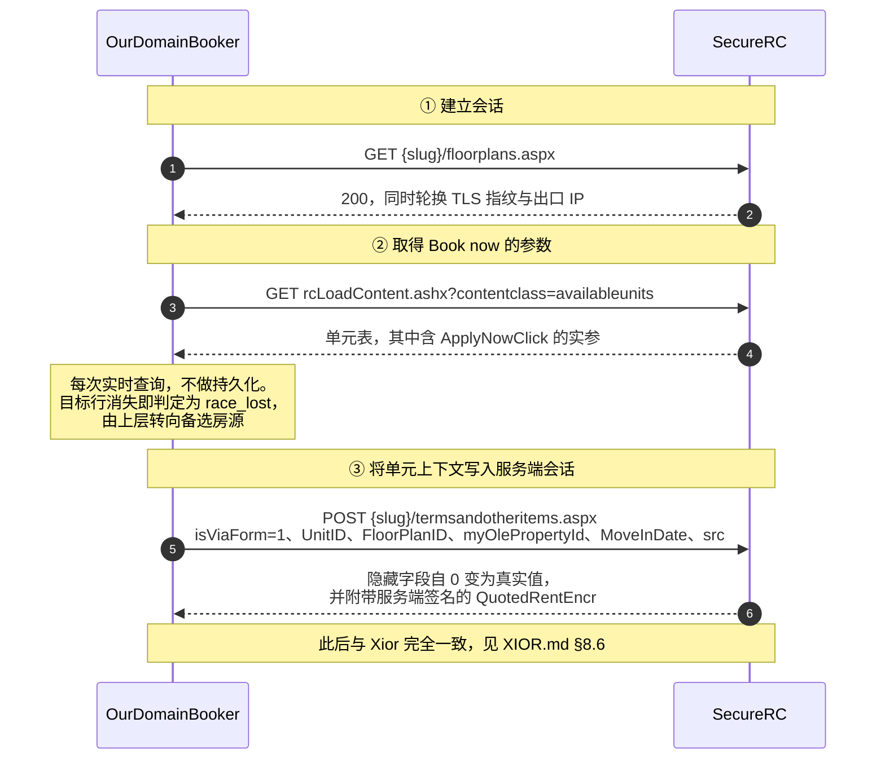

# OurDomain — 平台状态

本文档记录 OurDomain 的抓取现状：端点形态、反爬机制、代码的应对方式，以及自动
预订当前所处的阶段。实现以 [`scrapers/ourdomain.py`](../scrapers/ourdomain.py)
为准，本文档描述的是该实现所依赖的外部事实。

---

## 1. 平台概况

| 项 | 值 |
|---|---|
| 官网 | `https://www.thisisourdomain.nl`（Webflow） |
| PMS | RENTCafe by Yardi（SecureRC） |
| 数据形态 | HTML table，两阶段 GET |
| 监控粒度 | 单元级（具体房间号 #6045，含面积/楼层/朝向） |
| 传输方式 | curl_cffi + **TLS 指纹轮换**（不走浏览器） |

**两栋楼是两个独立的 RENTCafe property，各自一个 host**：

| city_key | host | property_id |
|---|---|---|
| `diemen` | `thisisourdomain.securerc.co.uk` | `184283` |
| `south-east` | `southeast-thisisourdomain.securerc.co.uk` | `182801` |

每栋楼对应一个独立的 `ScrapeTask`。楼盘规模较小，单栋的可订单元长期维持在个位数。

---

## 2. 反爬现状

OurDomain 是四个平台中唯一**无需浏览器**的：SecureRC 仅做 WAF 级 403，不设托管
挑战。但它另有一套机制——按 TLS 指纹与出口 IP 双重跟踪。

### 2.1 403 的两个维度

| 维度 | 表现 | 应对方式 |
|---|---|---|
| TLS 指纹 | 同一指纹短时间内重复请求即进入「挑战中」，返回 403 与 `Just a moment...` | 更换指纹 |
| 出口 IP | 同一 IP 被标记后，**轮换全部指纹仍返回 403** | 更换 IP |

第二条是关键：更换指纹只有在同时更换 IP 的前提下才有效。因此 `scrape()` 的重试
循环中**每次尝试都会重新获取代理**，并启用 `rotating=True`：

```python
proxy = get_proxy_url(self.source, rotating=True)
```

这与 Holland2Stay 和 Xior 的策略相反：后两者需要出口 IP 保持稳定才能复用
Cloudflare clearance，而 OurDomain 没有可复用的 clearance，更换 IP 才是其恢复
手段。此处曾出现过问题：将其固定到专属 sticky IP 之后，一旦该 IP 被标记，轮换
全部指纹亦均返回 403，无法自行恢复。

### 2.2 指纹池与冷却

默认池含 8 个指纹，覆盖 4 个浏览器家族的桌面与移动版本（`_DEFAULT_IMPERSONATES`）。
如此选取的目的是**扩大可用指纹空间**：同一家族同一平台的 JA3/JA4 与 h2 settings
差异很小，混入 Safari、Firefox 及移动端指纹后，某一家族被标记时仍有特征完全不同
的通路可用。

已排除的指纹包括：旧版本（chrome99–110，已被判定为「可疑或过时浏览器」）、
`tor145`（会触发高强度挑战），以及带 `beta` 后缀的不稳定版本。

进程级状态机（`_FINGERPRINT_STATE`，重启后清空）的规则如下：

- 请求成功：记录 `last_good_at`，并**清除**其 cooldown；
- 返回 403：记录 `cooldown_until = now + 30min`；
- 排序优先级：`last_good`（未处于冷却）→ `fresh` → 处于冷却中者作为最后备选。

冷却中的指纹必须先从 `last_good` 分组中排除再行排序——否则「曾成功且正在冷却」
的指纹会同时落入两个分组，去重时保留首次出现的位置，反而被排至最前，使冷却对最
需要冷却的指纹完全失效。

单轮尝试次数由 `OURDOMAIN_WAF_RETRIES` 控制（默认 4，上限 8）；指纹顺序可通过
`OURDOMAIN_IMPERSONATES` 覆盖。

### 2.3 同一 session 内的 403 重试

首次返回 403 时，Cloudflare **同时下发了 `cf_clearance` cookie**。curl_cffi 不执行
JS，无法算出最终 token，但该 cookie 已保存在 session 中——多数情况下短暂等待 2 秒
后对同一 URL 发起第二次 GET 即可通过（Cloudflare 在检测到部分 cookie 后会放宽为
light challenge）。

因此遇到 Cloudflare 类 403 时先在同一 session 内重试**一次**，仍失败才抛出
`BlockedError` 交由上层更换指纹。稳态下单个指纹即可稳定服务，该步骤可显著减少
更换指纹的开销。

### 2.4 仅使用 GET

POST 请求会触发 403，两个数据端点均采用 GET。

---

## 3. 端点契约

### 3.1 阶段一：floorplans.aspx —— 发现 FP ID

```
GET {base}/{slug}/floorplans.aspx
```

该阶段用于提取 floorplan ID。两栋楼采用不同的 RentCafe 主题，ID 出现的格式二者
取其一：

| 格式 | 出现位置 | 适用楼栋 |
|---|---|---|
| `subPointerId=NNNN` | photo gallery 的 onclick | Diemen |
| `myFloorPlanId=NNNN` | Get Notified / Contact Us 链接 | South-East |

同时解析 `{fp_id: fp_name}` 映射，仅在推断 Occupancy 时作为备选依据。可用的数据
来源是每个 FP 的 anchor：

```
onclick="showDialog('Floor Plan Executive Studio | Furnished | Contract 1-5 years',
                    'photogallery', 'imagetype=floorplan&...&subPointerId=1106316&...');"
```

其第一个参数为完整的 FP 名称，同一 onclick 中的 `subPointerId` 即为其 ID，二者
强耦合。

> 另有两条路径经验证不可行：`#FFloorPlan` dropdown 的 checkbox label 由 JS 动态
> 渲染，curl_cffi 无法获取；anchor 的 `title` 属性在生产环境的服务端 HTML 中均为
> `"1"`、`"Max Rent"` 之类的占位文本，不含 FP 名称。

**FP 层级的按钮状态不可靠**：实测标记为 `contactButton`（"Get Notified"）的 FP，
其单元层级仍全部显示为 "Available"。判定必须以单元层级为准。

### 3.2 阶段二：availableunits —— 获取单元

```
GET {base}/rcLoadContent.ashx
    ?contentclass=availableunits
    &floorPlans={fp_id}
    &MoveInDate={YYYY-MM-DD}
    &myolePropertyID={property_id}
```

`MoveInDate` 取下月 1 日。实测 5 月至 9 月的不同日期返回的单元完全相同，因此仅
查询单一日期；若日后发现结果随日期出现显著变化，再扩展为并行查询两个日期。

每个单元对应一行：

```html
<tr id="unitrow_307195" data-selenium-id="urow1">
  <th data-selenium-id="Apt1"  id="307195">#6045</th>
  <td data-selenium-id="SqFt1" data-label="Sq.M.">22</td>
  <td data-selenium-id="Rent1">€ 1.587</td>
  <td data-selenium-id="Deposit1">€ 2.622</td>
  <td data-selenium-id="Amenity1">
    <label>Ground Floor</label>
    <label>Courtyard View</label>
  </td>
  <td data-selenium-id="AvailDate1">
    <span class="text-success">Available</span>     <!-- 或 text-warning / Wait List -->
  </td>
  <td data-selenium-id="Action1">
    <input value="Book now" onclick="ApplyNowClick('307195','1107060','184283','6-6-2026',...)" />
  </td>
</tr>
```

**字段提取采用双重策略**：两栋楼使用不同的 RentCafe 主题，`data-selenium-id` 的
编号并不一致。先按 selenium-id 精确匹配，未命中时再按 `data-label`（即用户可见的
列标题：`Sq.M.` / `Apartment` / `Rent` / `Deposit` / `Amenities` / `Availability`）
匹配——后者在不同主题间更为稳定。核心字段全部为空时会记录一条 WARNING，便于事后
确认哪些主题仍需补充 label 匹配。

`available_from` 自 `ApplyNowClick(...)` 的 `DD-MM-YYYY` 参数提取。

### 3.3 单元会重复出现在多个 FP 下

同一个物理单元（例如 #6045，ID `307195`）会出现在该楼**全部** FP 的查询结果中
——FP 表示的是合同类型标签，单元才对应物理房间。`_merge_unit()` 按 `unit_id`
去重，仅收集 FP 标签而不重复创建 Listing。

由此可推出：**`floorPlans` 过滤器不可信**，不能依据 FP 至 unit 的映射判断单元
类型。因此 Occupancy 改由 `sqft` 反推（小于 30 m² 为 One，30–60 为 Two，不小于
60 为 Family），FP 名称仅在 `sqft` 缺失时作为备选依据。

---

## 4. 状态映射

| `<span>` class 或文本 | 含义 | 映射结果 |
|---|---|---|
| `text-success` / `Available` | 可预订 | `Available to book` |
| `text-warning` / 含 `wait` | 等位中 | `Available in lottery` |
| 其它情形，或该行不存在 | 已出租 | `Occupied` |

Wait List 仍计为可预订（部分用户愿意等待），这与 `Listing.is_available` 的语义
一致。

单元级租金为**单一数值**（如 `€ 1.587`），而非 FP 级的区间，可直接交由
`parse_float` 处理。

---

## 5. Listing 映射

```python
Listing(
    id             = f"od_{unit_id}",              # "od_307195"
    name           = "Diemen #6045",               # 楼栋短名 + 房号
    status         = <见 §4>,
    price_raw      = "€ 1.587",
    available_from = "2026-06-06",
    features       = [
        "Unit: #6045",
        "Building: Amsterdam Diemen",
        "Address: Dalsteindreef, 1112 XJ Diemen",          # 建筑级真实街道地址
        "Type: Studio",
        "Area: 22 m²",
        "Occupancy: One",                                  # 由 sqft 反推
        "Floor: 0",
        "Deposit: € 2.622",
        "Detail: Ground Floor, Courtyard View",
        "Floorplans: 1107060, 1106316",
    ],
    url            = f"{base}/{slug}/floorplans.aspx",
    city           = "Amsterdam Diemen",
    source         = "ourdomain",
)
```

`Address` 为**建筑级的真实街道地址**（硬编码于 `BUILDINGS` 中），供 geocode 使用
——unit 名称 "Diemen #6045" 是内部单元编号，无法用于地理编码。同栋楼的全部单元
共享同一个坐标点，与物理事实相符。

`Occupancy` 采用与 Holland2Stay 相同的词汇表（`One` / `Two (only couples)` /
`Family (parents with children)`），因此 Web 端的 Occupancy 多选过滤器可跨 source
自然合并。楼层由 `parse_ourdomain_floor()` 自 Detail 字段提取（`Ground Floor` 记为
0，`Floor 1-4` 记为 1）。

---

## 6. 风险

| 风险 | 现状 |
|---|---|
| SecureRC 启用托管挑战 | 尚未发生。一旦发生，需与 Holland2Stay、Xior 一样改走浏览器传输层 |
| 403 频率上升 | 处于可缓解范围内（每次尝试更换 IP、指纹池轮换、同 session 重试）；实测每小时数次，轮换指纹后即恢复 |
| `data-selenium-id` 变更 | 该属性是 Yardi 的测试锚点，移除成本较高；且已有 `data-label` 作为备选匹配 |
| 出现新主题或新字段名 | 核心字段全部为空时会记录 WARNING，据此补充 label 匹配 |
| 楼盘规模较小 | 属固有限制，单栋的可订单元长期维持在个位数。新增楼栋时补充一条 `BUILDINGS` 记录即可 |

---

## 7. 自动预订（2026-08-04 侦察重写）

实现位于 [`bookers/rentcafe.py`](../bookers/rentcafe.py) 中的 `OurDomainBooker`。
`monitor._AUTO_BOOK_SOURCES` 中**不含** `ourdomain`，该链路对用户处于关闭状态。

### 7.1 结论：与 Xior 为同一套流程，仅入口不同

本文档此前记载的「多步 ASP.NET 表单流尚未探明」已经过时。实测表明 OurDomain 与
Xior 运行的是**同一套 RENTCafe，且契约逐字相同**：

| | Xior | OurDomain（两栋楼均已测试） |
|---|---|---|
| 条款页验证码 | 标准 v3 `api.js` | 同 |
| v3 sitekey | `6LcjBc4U…bzl` | 同 |
| action | `start_application` | 同 |
| 回退标志字段 | `failed-captcha-3-rentable` | 同 |
| v2 sitekey | `6LfAdx8T…B1V0` | 同 |
| 条款表单 id / action | `termsandotheritems` → `/onlineleasing/rcformsave.ashx` | 同 |
| 登录页表单 | `Login` / `UserLogin` / `OtpOptions` / `VerifyOTP` | 同 |
| **密码登录是否带验证码** | 不带（验证码位于 OTP 路径上） | 同 |

连页面 JS 的函数名（`callReCaptchaV2Rentable` / `getCaptchaTokenRentable`）亦完全
一致。因此 [`docs/XIOR.md`](XIOR.md) §8 中的整套侦察结论——会话层、登录环节的四处
陷阱、验证码契约、申请表字段由页面驱动、证件上传接口、成败判据，以及锁定发生在
付款环节——**对 OurDomain 同样成立**，此处不再重复。

`captcha/rentcafe_pages.py` 中 `oleapplication` 与 `termsandotheritems` 分列两行
而未做别名处理：该表的用途是记录「各页面实测所呈现的形态」，合并会把「两页恰好
一致」记录成「本就是同一页」，此后 Yardi 若只修改其中一侧便无从察觉。

### 7.2 唯一的差异：入口

**Xior** 的 `applyOnlineURL` 直接指向 `oleapplication.aspx`，单元信息预填于 URL 中，
选房发生在**登录之后**。

**OurDomain** 的条款步骤为独立页面，选房发生在**登录之前**，且入口需自行构造：



`ApplyNowClick` 的第 5 个参数即为步骤 ③ 的目标页（`termsandotheritems.aspx`），
与 Xior `ContinueClick` 的第 6 个参数同构——**二者位置不同，且写错不会报错**，
只会携带一组错位的参数提交。因此两个平台各自保留一个解析函数，不做「带开关的
通用解析」。

步骤 ③ 执行前后的对比（实测）：

```
直接 GET termsandotheritems.aspx    执行 POST 之后
  UnitId        = '0'                 UnitId        = '211053'
  FloorplanId   = '0'                 FloorplanId   = '1113962'
  QuotedRent    = '0'                 QuotedRent    = '1138.00'
                                      QuotedRentEncr= 'MTEzOC4wMA%3d%3d-RquIlWlxLKs%3d'
```

**仅提交上述五个参数，不回传 QuotedRent。** 报价由服务端自行计算并签名，提交
历史价格轻则被拒绝，重则会以一个过期价格创建申请。

单元参数**每次实时查询，不做持久化**。已保存的 `FloorPlanID` 与 `MoveInDate` 会
过期，且存量参数无法回答「该单元当前是否仍然存在」这一问题——实时查询该表相当
于同时完成了一次竞争检测：对应行消失即判定为 `race_lost`，由上层转向备选房源。
这与 Xior 侧 `find_unit` 所做的是同一件事，仅数据源不同。

### 7.3 尚待完成的部分

| 项目 | 状态 |
|---|---|
| ①②③ 入口段 | **已实测走通**（2026-08-04，使用真实单元，条款表单 18 个字段全部正确填入） |
| ④ Start Application | 未执行（需消耗验证码费用，且会在服务端创建 prospect 记录） |
| ⑤ 登录后单元上下文是否保留 | **未验证**。OurDomain 的流程中不含选房页，一旦脱离流程便没有 Xior 那样的重选入口。代码的处理方式为：核对落地页是否为 Applicant Info，若否则重新提交一次 Book now，仍不匹配则明确报错中止 |
| 申请表字段 | 尚未观察到。`rentcafe_applicant.TEXT_FIELDS` 中的 `STU_*` 三项为 Xior 自定义字段，OurDomain 很可能不具备——字段缺失时会抛出 `FormShapeChangedError`（**这是正确行为**，宁可中止也不提交字段不全的申请） |
| 账号为全局一套还是每栋楼一套 | **未验证**。两栋楼分属两个 securerc 主机，cookie 不跨主机，参照 Xior 的经验很可能需要分别配置。当前使用面板上已有的单一 `ourdomain_email` / `ourdomain_password`，待验证暴露问题后再照 `xior_accounts` 拆分 |

其边界与 Xior 相同，止于 **Save（保存草稿）**：再往前是 `ApplicationCharges`，需
填写 IBAN / SWIFT，代填金融凭据是硬性限制。`draft_saved` **不代表预订成功**。
