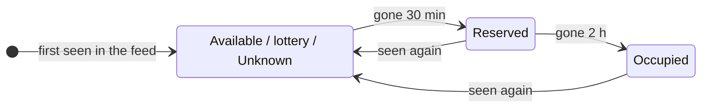

# FlatRadar

[](https://flatradar.app) [](https://flatradar.app/guide) [](https://flatradar.app/support) [](https://github.com/sponsors/751K) [](../LICENSE) [](https://github.com/751K/holland2stay-monitor/releases) [](https://www.python.org/) [](../ios/FlatRadar) [](../android)

> 中文版：[README_cn.md](README_cn.md)

In the Dutch rental market the difficulty is rarely finding a listing. It is
**seeing it before someone else books it**: a good unit can go from published to
taken within the hour, and refreshing a search page all day is not practical.

FlatRadar takes over that part. It monitors several rental platforms at once and,
as soon as a listing matches your criteria, sends a notification through the
channels you enabled, with a direct link included. For Holland2Stay it goes one
step further: it first carries the booking through to the payment page, then
sends the payment link along with the alert, so only the payment itself remains.

Its limits should be stated alongside that: **the system never pays on your
behalf, and it cannot guarantee a booking succeeds.** What it shortens is the
interval between a listing going live and you learning of it. Everything beyond
that still depends on the competition on the platform.

The project is self-hostable: one container, one SQLite file, no external
services beyond the notification channels you choose to enable.

**Website:** [flatradar.app](https://flatradar.app) ·
**User guide:** [flatradar.app/guide](https://flatradar.app/guide) ·
**Support:** [flatradar.app/support](https://flatradar.app/support) ·
**Contact:** [surrport@flatradar.app](mailto:surrport@flatradar.app)

> FlatRadar is an independent, unofficial tool. It is not affiliated with,
> endorsed by, sponsored by, maintained by, or operated by any housing platform
> it monitors. Use it only for personal, non-commercial purposes and follow each
> platform's terms. Always verify listing details, prices, eligibility, and
> booking status on the official platform before making decisions.

---

## Feature overview

| | |
|---|---|
| **Coverage** | Four platforms: Holland2Stay, OurDomain, OurCampus and Xior. Polling tightens during the hours when new listings tend to appear |
| **Alert channels** | Web, Telegram, Email, WhatsApp, iOS push, Android push, iMessage; several may be enabled at once |
| **Filters** | Maximum rent, minimum area, minimum floor, type, occupancy, city, neighbourhood, platform, contract type, tenant requirements, and others |
| **Views** | List, map, calendar, dashboard and charts, in English or Chinese |
| **Multiple users** | Supported. Guest, user and admin roles; every user keeps independent filters and credentials |
| **Auto-booking** | Holland2Stay only, and it stops at the payment page — see [Auto-booking](#auto-booking) |

### Platform coverage

| Platform | Coverage | Scraper maturity | Booking |
|---|---|---|---|
| Holland2Stay | Any Dutch city you configure | Proven — the bulk of what lands | Auto-booking supported |
| OurDomain | Amsterdam Diemen / South-East | Proven | Notify only (booking flow built, not enabled) |
| Xior | Any of 30 buildings across 14 cities | Proven | Notify only (booking flow built, not enabled) |
| OurCampus | Amsterdam Diemen (1 building) | **Unproven** — see below | Notify only |

**OurCampus has never returned a single available unit.** It is polled normally
and its floorplan panels come back valid, but the unit table its parser expects
has not shown up once. The parser is inherited from OurDomain and has never been
checked against real markup, so its status mapping, its thresholds and the
premise that the feed lists only bookable units are all unverified. Every request
writes a summary line to `data/ourcampus_capture.txt`, and the first response
that actually parses a unit gets its full HTML archived there — check that file
to see where your own instance stands. Until such a sample exists, treat
OurCampus as untested code that happens to run.

Expect lopsided volume in general. Holland2Stay covers whole cities and is where
most listings come from; the other three are individual buildings, so a handful
of them will never add up to a comparable pool. The sources are separate pools,
not redundancy for each other.

Coverage shifts as third-party sites change. The scrapers are documented in
[XIOR.md](XIOR.md), [OURDOMAIN.md](OURDOMAIN.md) and
[SCRAPING_RECON.md](SCRAPING_RECON.md).

### Clients

| Interface | Status |
|---|---|
| Web dashboard | Stable — the primary interface for self-hosting |
| [iOS app](https://apps.apple.com/us/app/flarradar/id6769857080) | Maintenance — on the App Store, feature-complete for current scope |
| [Android app](https://github.com/751K/holland2stay-monitor/releases/latest/download/app-release.apk) | Beta — signed `.apk`, sideload it. FCM push verified. Not going to Play Store — direct download is the distribution channel |
| Desktop packages | macOS `.dmg` and Windows `.zip` from [Releases](https://github.com/751K/holland2stay-monitor/releases) |

---

## Requirements

|  | Minimum | Notes |
|---|---|---|
| RAM | **2 GB** | Each Cloudflare-protected source keeps a headless Chromium resident (~200–400 MB each). 1 GB is only enough for a single source. |
| Disk | ~1.5 GB | The patched Chromium alone unpacks to ~700 MB |
| Docker | Engine 20.10+ with the Compose plugin | `docker compose`, not the old `docker-compose` script |
| Python | 3.11+ | Only for running from source. The Docker image ships 3.11; CI and desktop builds use 3.12 |
| OS | Linux recommended | See the [macOS note](#running-from-source) below |
| Domain | Optional | Needed only for the HTTPS deployment. The local path below runs without one |

Nothing else is required — no external database, no message broker, no
telemetry backend. State is one SQLite file.

---

## Quick start

Two paths: the first to confirm it runs, the second for anything you intend to
depend on.

### 1. Try it locally

No domain and no certificate required. Run:

```bash
git clone https://github.com/751K/holland2stay-monitor.git
cd holland2stay-monitor
cp .env.example .env
mkdir -p data logs
docker compose -f docker-compose.yml -f docker-compose.local.yml up -d h2s
```

The first build takes a few minutes. When it finishes, open
`http://127.0.0.1:8088` — no login required.

> ⚠️ In this mode the panel is plain HTTP with no password and listens on the
> loopback address only. **Do not use it on a public server**; for that, use the
> second path below.

Out of the box it monitors Holland2Stay in Eindhoven only. Enable the rest from
the panel.

### 2. Deploy to a server

**Before you start** you need three things: a server with Docker installed, a
domain whose A/AAAA record points at it, and ports 80/443 open.

**Step 1** — create the config and data directories:

```bash
cp .env.example .env
mkdir -p data logs logs/caddy
```

**Step 2** — edit `.env` and fill in at least these five keys:

```env
WEB_PASSWORD=a-long-random-string
SESSION_COOKIE_SECURE=true
PUBLIC_BASE_URL=https://your.domain.com
SUPPORT_EMAIL=support@example.com
TIMEZONE=Europe/Amsterdam
```

**Step 3** — edit `Caddyfile` and replace `your.domain.com` with your domain.

**Step 4** — start it:

```bash
docker compose up -d
```

Caddy obtains and renews the certificate on its own. Once it is up, open your
domain and sign in as `admin` with the password you set in step 2.

> If the container does not come up and the log shows a `FATAL` line, step 2 or
> step 3 is incomplete — the message says which.

### Confirming it works

Both processes should report `RUNNING`:

```bash
docker exec h2s supervisorctl -c /etc/supervisor/conf.d/app.conf status
```

Follow the first round:

```bash
docker compose logs -f h2s
```

The first round is slower than later ones; that is expected. A healthy round ends
with `本轮完整扫描: N/N 城市 (...)` followed by `本轮结束: ... 新房源`.

Once signed in, add users and notification channels, then pick the platforms and
cities to monitor. Both user-level and system-level settings are managed from the
panel; `.env` only needs editing when credentials, the domain or the timezone
change.

### Running from source

For development. Production should use Docker — the container pins the Chromium
build and the supervisor setup.

```bash
pip install -r requirements.txt
python -m cloakbrowser install   # patched Chromium, ~700 MB unpacked
cp .env.example .env
python web.py                    # panel only
python monitor.py                # scraper loop, separate terminal
```

Open `http://127.0.0.1:8088`. Note that `web.py` and `monitor.py` are two
independent processes that only talk through SQLite — running just `web.py`
gives you a panel that never gets new data.

> **macOS**: the free CloakBrowser build for macOS lags the Linux one, and
> headless mode can abort, so local runs fall back to a visible browser window.
> Use Linux/Docker for anything you actually depend on.

---

## Upgrading and backups

Upgrading requires rebuilding the image — `git pull` alone has no effect.
`.env` and `data/` are preserved.

```bash
cd /path/to/holland2stay-monitor
cp data/listings.db "data/listings.db.bak.$(date +%Y%m%dT%H%M%S)"
git pull
docker compose build h2s
docker compose up -d --force-recreate h2s
```

Neither of the last two commands is optional: without `build` nothing is
upgraded, and without `--force-recreate` the old container keeps running the old
code.

Two things need backing up, and they **must be backed up together**:

- `data/listings.db` — listings, users, credentials, device tokens, and
  system settings (`app_settings`)
- `.env` — the secrets, in particular `DATA_ENCRYPTION_KEY`

Passwords and platform credentials in the database are encrypted with the key in
`.env`; restoring one without the other leaves you with credentials nobody can
decrypt. As of v1.16.0 the monitoring scope and polling cadence also live in the database; restoring only `.env` falls back to code defaults.

**Do not copy the database file directly while the container is running** — you
will miss recent writes. For a consistent snapshot:

```bash
docker exec h2s python -c "import sqlite3; \
  sqlite3.connect('data/listings.db').execute('VACUUM INTO \"data/backup.db\"')"
```

---

## Configuration

Configuration lives in three places, with clear boundaries:

| What | Where | Edited via |
|---|---|---|
| Per-user: channels, filters, auto-booking | SQLite `user_configs` | Dashboard → Users |
| System: sources, cities, intervals | SQLite `app_settings` | Dashboard → Settings |
| Deployment: credentials, paths, timezone, base URL | `.env` | Text editor |

**Monitoring scope and polling cadence are not in `.env`.** As of v1.16.0,
20 keys — `SOURCES`, `CITIES`, `*_CITIES`, `AVAILABILITY_FILTERS`,
`CHECK_INTERVAL`, `PEAK_*` and friends — live in the database and are managed
from the dashboard. First start migrates them out of `.env` automatically,
backing up the whole file to `.env.bak.<timestamp>` beforehand and logging
exactly what moved.

What remains in `.env` is roughly 28 keys in three groups:

| Group | Count | Notes |
|---|---|---|
| Credentials | 14 | Passwords, API keys, encryption key, proxy URLs. **Never in the database** — databases get backed up, exported, downloaded |
| Deployment facts | 5 | `DB_PATH`, `TIMEZONE`, `PUBLIC_BASE_URL`, `SESSION_COOKIE_SECURE`, `SUPPORT_EMAIL`. `DB_PATH` must stay here — you need the database before you can read the settings table |
| Thresholds and switches | 9 | Notification channel toggles and quotas; all have defaults, most deployments set none |

The ones worth knowing up front:

| Key | Default | What it controls |
|---|---|---|
| `WEB_PASSWORD` | — | **Required.** The container refuses to start without it |
| `HTTPS_PROXY` | — | Required in production. Datacenter IPs get 403'd by Cloudflare on Holland2Stay |
| `PUBLIC_BASE_URL` | — | Required in production, or verification emails link to an internal host |
| `MONITOR_HEARTBEAT_MAX_AGE` | `900` | How long the monitor may be silent before `/health` reports unhealthy |
| `HEALTH_*` / `WATCHDOG_*` | see `.env.example` | Thresholds for the data-degradation alerts behind `/monitoring` |
| `STALE_RESERVED_HOURS` / `STALE_OCCUPIED_HOURS` | `0.5` / `2` | How long a listing must be absent from the feed before it is inferred Reserved, then Occupied — see [Listing status](#listing-status) |

The full list is in [.env.example](../.env.example), which documents every key;
key names and their groups are registered in `env_registry.py`.

### Environment variables win over the database

Resolution order is **environment variable > `app_settings` > code default**.
The environment layer exists as an override hatch for containerised debugging:

```bash
docker compose run -e CHECK_INTERVAL=30 h2s python monitor.py
```

The cost is that it is invisible: the dashboard shows one value, the process
uses another. So the dashboard flags "overridden by an environment variable,
changes here will not take effect", and the monitor warns at startup about any
such key left in `.env`. **Use the dashboard for day-to-day changes** — writing
these keys back into `.env` silently overrides it.

### Input validation

Misspelled key names are no longer silent. The monitor audits `.env` at startup
and warns about unregistered keys, with the closest match:

```
PEAK_STRAT is not a key this project knows; it will have no effect (did you mean PEAK_START?)
```

Malformed scope values are caught too, with two different outcomes: format
errors (delimiters, field counts, non-numeric ids) are rejected by the dashboard
outright; unknown entities (a city id or platform name absent from the known
tables) only warn and still save — official registries change, and hard-failing
would turn a newly launched city into a save error.

### Enabling a new platform

In Dashboard → Settings, tick the platform **and** its cities or buildings.
Both are required; ticking only the cities does nothing. Sources listed in
`SHADOW_SOURCES` are scraped and stored but send **no** notifications — useful
for validating a new platform before exposing it to users. Entries missing from
`SOURCES` are ignored with a warning: a source listed there but not enabled is
simply off, not shadowed.

Before a production deploy:

```bash
python -m tools.doctor --no-network
```

Run it on the host, in the repository directory — `tools/` is deliberately not
copied into the image. It is read-only: it never writes config, sends
notifications, or touches the monitor process.

Its `Settings` section answers the most common post-deploy question: whether the migration ran (how many rows are in `app_settings`), whether any key left in `.env` is overriding the dashboard, and whether any key name is misspelled.

---

## Listing status

No platform tells you a unit is gone. They simply stop returning it. Xior is the
only source whose feed carries a real `Occupied` state, and even there it covers
just part of the picture. Everywhere else, a terminal status is something the
system worked out rather than something a platform said.

So absence is the signal, and it is read in two steps:


```mermaid
stateDiagram-v2
    direction LR

    state "Available / lottery / Unknown" as A
    state "Reserved" as R
    state "Occupied" as O

    [*] --> A: first seen in the feed
    A --> R: gone 30 min
    R --> O: gone 2 h
    R --> A: seen again
    O --> A: seen again
```

Anything the system inferred carries an **inferred** badge in the panel and a
`status_is_inferred` flag in the API, so a reported status and a deduced one are
never confused — in practice most `Occupied` rows you see will be inferred.
Inferred transitions do not generate notifications.

Two hours is not arbitrary — it is Holland2Stay's own payment deadline. A
reservation that has been out of the feed longer than that has resolved one way
or the other. The intermediate Reserved stop exists so that being wrong is
cheap: `Reserved → Available` is an ordinary transition, whereas jumping
straight to Occupied and then seeing the listing return produces a wave of false
"back on the market" alerts. Both thresholds are configurable
(`STALE_RESERVED_HOURS` / `STALE_OCCUPIED_HOURS`); the reasoning and the failure
modes behind them are in
[ARCHITECTURE.md §5.13](ARCHITECTURE.md#513-从-feed-里消失是唯一的下架信号).

Convergence only runs for source/city pairs that were **completely** scanned
that round. A failed scrape is never read as "the listings are gone".

---

## Auto-booking

Enabled for Holland2Stay only. It signs in with the account you configure,
attempts eligible directly-bookable listings, and **stops at the payment URL** —
it never completes a payment.

Xior, OurDomain and OurCampus run the same RENTCafe backend and share one
implementation ([`bookers/rentcafe.py`](../bookers/rentcafe.py)). The code is
complete, reCAPTCHA solving is wired up, and the flow has been walked end-to-end
against a live site. It is still **switched off** —
`monitor._AUTO_BOOK_SOURCES` lists Holland2Stay only, and no user can turn it
on from the panel. What is missing is verification, not code:

| Platform | Reached | Missing |
|---|---|---|
| Xior | Applicant form, draft saved, ID document uploaded (2026-08-03, real account) | Whether the form saves cleanly once the system supplies the document. And a Xior draft **does not hold the unit** — it stops a step earlier than Holland2Stay, because the next page asks for IBAN/SWIFT |
| OurDomain | Entry leg verified against the live site (2026-08-04): floorplans → available units → terms POST, all 18 form fields landing | Everything after login. This flow has no unit-picker page, so falling out of it has no recovery path — the code aborts loudly rather than continuing with a mismatched context. Needs a real OurDomain account |
| OurCampus | Nothing | Booking flow has never been scouted |

Both stop at the same wall Holland2Stay does: the next step is
`ApplicationCharges`, which wants IBAN/SWIFT. Entering financial credentials is
a hard limit. Details in [XIOR.md](XIOR.md) §8 and
[OURDOMAIN.md](OURDOMAIN.md) §7.

> The hosted demo has auto-booking disabled for user accounts. Email us or
> [self-host](#quick-start) to use it.

---

## Troubleshooting

Start at **`/monitoring`** (admin). It shows per-source health, the last 30 rounds
broken down as `listings (complete/targets)`, and any active alerts — most of the
table below can be answered there without shelling into the container.

`/health` and `/monitoring` answer different questions. `/health` is *"is the loop
alive"* (heartbeat freshness) and drives the container's health status.
`/monitoring` is *"is the data still right"* — a parser broken by an upstream
redesign leaves `/health` green. Data degradation alerts admins; it deliberately
does **not** flip the container unhealthy, because restarting cannot fix a parser
mismatch and would only interrupt a scrape in progress.

| Symptom | Cause and fix |
|---|---|
| No alerts at all, dashboard shows stale listings | The monitor process is down. `supervisorctl status` to confirm, then `supervisorctl start monitor`. `/health` returns 503 once the heartbeat is older than `MONITOR_HEARTBEAT_MAX_AGE`. |
| A source shows `down` or `warn` on `/monitoring` | The card lists which rule fired. Thresholds and their rationale: [ARCHITECTURE.md §5.12](ARCHITECTURE.md). |
| Need logs from a specific time window | `/logs` filters server-side by keyword, level and `since`/`until` — it is not limited to what is currently on screen. |
| Logs repeat `H2S source 熔断` | Cloudflare is blocking your exit IP. The breaker pauses that one source and retries a single city later. If it persists, set `HTTPS_PROXY`. |
| Logs repeat `CF 挑战 ... 未解开` | Same cause — usually IP reputation rather than anything local. |
| One platform always returns 0 listings | May be genuine. Check whether the round was marked complete; see [ARCHITECTURE.md §5.7](ARCHITECTURE.md#57-completeness-决定能否做状态收敛). |
| A listing you know is taken still shows as available | Its city was not completely scanned, so it never became eligible for convergence. Check `(complete/targets)` on `/monitoring`. |
| A batch of listings turned Occupied at once | Expected if they carry the **inferred** badge — that is aging catching up after a restart or a threshold change, and it generates no notifications. Without the badge, the platform actually reported it. |
| Logs repeat `抓到 0 个单元，第 N/3 轮` | Normal. An empty result from OurDomain/OurCampus has to repeat for 3 rounds before it counts, so a single bad round cannot converge a whole building. |
| Container gets OOM-killed | Raise `mem_limit`. Each Cloudflare-protected source holds a resident browser. |
| Container will not start, log says `FATAL` | The entrypoint preflight. Either `Caddyfile` still says `your.domain.com` or `WEB_PASSWORD` is empty. Both are refusals to expose an unauthenticated panel. |
| Cannot sign in after setting `WEB_PASSWORD` | The username is `admin` unless you set `WEB_USERNAME`. |
| `supervisorctl` says "no such file" | Its socket is not at the default path. Add `-c /etc/supervisor/conf.d/app.conf`. |

The container reporting `healthy` covers both web and monitor, but an unhealthy
container is **not** restarted automatically — wire the health status into your
own monitoring if you want to be paged.

---

## Documentation

| Document | For |
|---|---|
| [User Guide](https://flatradar.app/guide) | Screenshots and daily use |
| [ARCHITECTURE.md](ARCHITECTURE.md) | How the system runs, and every failure mode worth knowing before you debug one |
| [API.md](API.md) | Backend contracts for mobile and integrations |
| [CHANGELOG.md](CHANGELOG.md) | Release history |
| [XIOR.md](XIOR.md) · [OURDOMAIN.md](OURDOMAIN.md) · [SCRAPING_RECON.md](SCRAPING_RECON.md) | Per-platform scraping research |
| [ANDROID_PLAN.md](ANDROID_PLAN.md) · [iOS_README.md](iOS_README.md) | Mobile client work |
| [dataflow_en.mmd](dataflow_en.mmd) · [dataflow_ch.mmd](dataflow_ch.mmd) | Full scrape/notify flow as a Mermaid diagram |

---

## Support the project

FlatRadar is built and run by one person. Server costs, push infrastructure and
App Store fees come out of pocket.

- Star the repository if it is useful to you.
- Sponsor via [GitHub Sponsors](https://github.com/sponsors/751K) or
  [flatradar.app/donate](https://flatradar.app/donate).
- Questions and bug reports: [flatradar.app/support](https://flatradar.app/support).

## License

See [LICENSE](../LICENSE).
