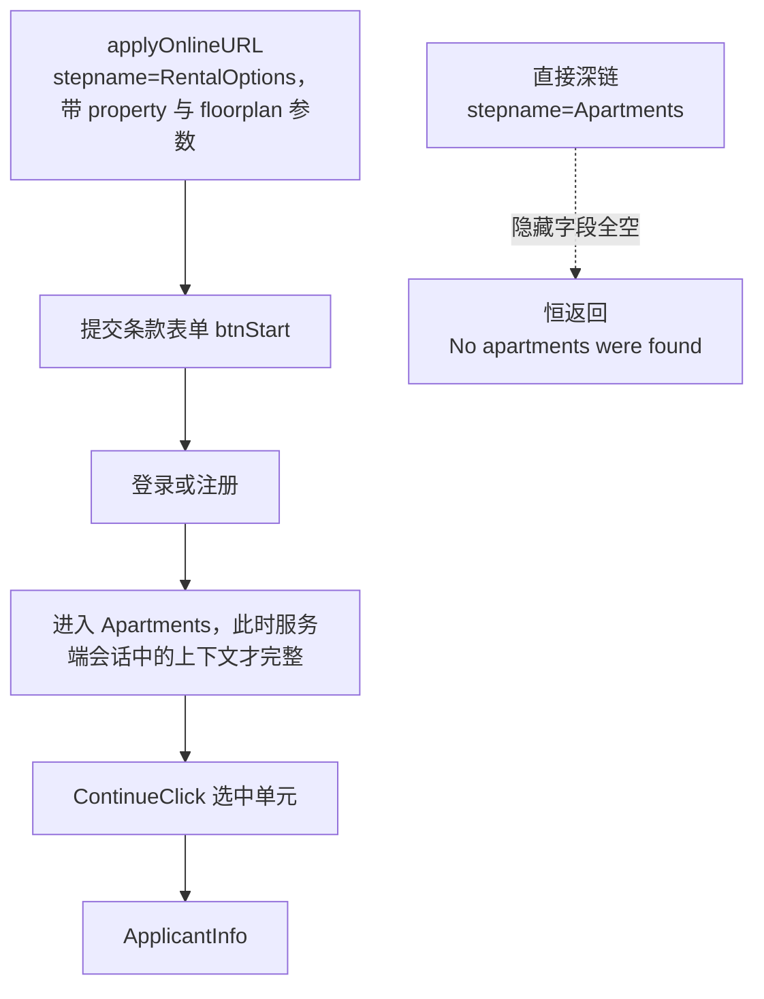
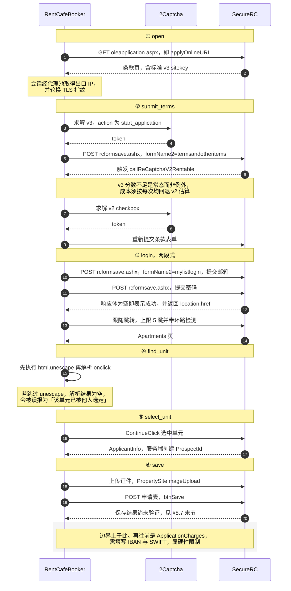

# Xior — 平台状态

本文档记录 Xior Student Housing 的抓取现状：端点形态、反爬机制、代码的应对方式，
以及自动预订当前所处的阶段。实现以 [`scrapers/xior.py`](../scrapers/xior.py) 为准，
本文档描述的是该实现所依赖的外部事实。

---

## 1. 平台概况

| 项 | 值 |
|---|---|
| 官网 | `https://www.xiorstudenthousing.eu`（WordPress） |
| PMS | Yardi / RENTCafe（与 OurDomain 同一套） |
| 数据端点 | `POST /wp-admin/admin-ajax.php`，`action=yardi_room_availability` 在**表单体**里 |
| 数据格式 | JSON |
| 监控粒度 | 单元级（具体房号、精确面积/租金/押金） |
| 覆盖范围 | 代码内注册 NL 30 栋 / 14 城；平台全欧 100+ |
| 传输方式 | **浏览器**（`BrowserFetcher` + `XIOR_PROFILE`） |

---

## 2. 反爬现状

### 2.1 Cloudflare 托管挑战（决定了传输方式）

`admin-ajax.php` 位于 Cloudflare 托管挑战之后。curl_cffi 的 TLS 指纹伪装**无法
通过**，恒返回 403 与挑战页；轮换整个指纹池亦无改善，可见问题不在指纹层面。

因此 Xior 采用浏览器传输层：`BrowserFetcher` 导航至
`https://www.xiorstudenthousing.eu/netherlands/` 通过挑战，再借助 `page.evaluate`
中的 `fetch` 发起**同源** POST。clearance 与 TLS 指纹绑定，将 cookie 转交 HTTP
客户端无效。

### 2.2 IP 级限流（决定了请求节奏）

Cloudflare 对该端点按 **IP** 限流，阈值约为每窗口 15–20 次请求，且**跨轮累积**，
并非每轮清零。在固定出口下每轮发起 12 次请求时，实测第 2 轮的首个请求即被 429
拒绝。

代码中由两道机制配合应对：

| 机制 | 参数 | 作用 |
|---|---|---|
| 全局请求间隔 | `_MIN_REQUEST_INTERVAL = 5.0` | 进程级锁，全部楼栋共用，将瞬时速率压至约 12 req/min |
| 浏览器轮换 | `_BROWSER_MAX_AGE = 900`（15 分钟）与 `rotating_proxy=True` | 重建浏览器即更换出口 IP，从而分摊累积量，约每 3–4 轮、每 IP 约 40 次请求 |

429 仍会发生（高峰时段每小时数次），退避重试由 `scrapers/base.py` 的
`RATE_LIMIT_BACKOFF` 负责；退避后仍失败则将整栋楼标记为 incomplete，由 monitor
执行逐 source 隔离，不影响其余平台。

**单轮耗时随楼栋数线性增长**，每栋楼的耗时约为「房型数 × 5 秒间隔」，实测在
14 秒量级——比其余三个 source 高出一个数量级（后者每个 target 仅需 1–4 秒）。
按此推算，注册表中的 30 栋楼需要约 7 分钟才能扫完一轮，而 `CHECK_INTERVAL` 仅为
300 秒；更为不利的是 Holland2Stay 排在其余 source **之后**执行，不做分片等于每轮
都将真正产出房源的那个 source 推迟数分钟。

因此监控全部 30 栋楼是通过分轮抓取实现的（默认 `SHARD_SIZES=xior:4`）：每轮抓取
若干栋，数轮覆盖一遍，游标持久化于 SQLite，重启后继续轮转。实现见
`monitor._apply_task_sharding()`。

需注意分片并不能单独解决问题：楼栋数减少后分片会自动失效（每轮即为全量抓取），
而单栋楼的请求频率反而升高。控制「同一 target 多久抓取一次」的是
`SOURCE_MIN_INTERVALS`，二者须配合使用。

#### 预订侧另有一道限流：按「IP × 写接口」（2026-08-03 实测）

抓取与预订访问的是**不同的主机**（前者为 API 端点，后者为 `*.securerc.co.uk`），
限流规则亦不相同。预订侧的实测结果如下：

- 同一出口 IP 连续执行 3 轮预订之后，`POST rcformsave.ashx` 开始**全部返回 403**；
- **同一时刻 `GET oleapplication.aspx` 完全正常**，可见并非整站封禁 IP，而是写接口
  被单独限制；
- 等待 7 分钟后仍未放行，冷却时长在 30 分钟量级，未做精确测定。

由此产生两项设计要求：

1. **预订会话必须经由代理池。** 抓取侧一直使用代理，而预订侧原先为
   `req.Session()` 直连，等于把整条链路上最关键、最不容失败的一步置于最易被限流
   的位置。现已改为通过 `RentCafeSession._new_session()` 自代理池取得出口。
2. **单条会话固定使用一个出口 IP。** 流程状态保存于服务端会话中，中途更换 IP 可能
   被直接判定为会话失效。更换 IP 仅发生在 `open()` 因 403 重建会话时——彼时本就
   需要从头开始，此刻更换出口不产生额外成本（与 Holland2Stay 侧
   `rotating_proxy=True` 的思路一致）。

TLS 指纹轮换无法解决此类问题：403 发生于会话中途，更换指纹需重建 Session 并丢弃
已有 cookie，等同于整个流程重新开始。因此会话中途出现的 403 只能归类为 `blocked`
并交由上层稍后重试，不应在会话内部重试。

### 2.3 Turnstile 不校验服务端

Yardi modal 里集成了 Cloudflare Turnstile：

```javascript
window.turnstile.render($tsEl[0], {
    sitekey: ...,
    action: 'yardi_room_availability',
    callback: window.onYardiTsSuccess,
});
```

但**端点本身并不校验该 token**。以下三组请求的返回结果完全一致：

| 请求 | 结果 |
|---|---|
| 不携带 `cf-turnstile-response` | `{"success":true, "data":{...}}` |
| `cf-turnstile-response: ""` | 同上 |
| `cf-turnstile-response: "dummy"` | 同上 |

因此在通过 §2.1 的托管挑战之后，无需再求解 Turnstile。两者属于不同层面：挑战由
Cloudflare 边缘实施，Turnstile 则是站点自行添加的前端组件。

---

## 3. 端点契约

### 3.1 请求

```
POST https://www.xiorstudenthousing.eu/wp-admin/admin-ajax.php
Content-Type: application/x-www-form-urlencoded

action=yardi_room_availability
property_page_id=1126     ← 楼的 WP page ID
room_type_id=33944        ← 房型 ID
semester_id=3281          ← 学期 ID
```

上述三个 ID 保存于 `XiorScraper.BUILDINGS` 这一**硬编码注册表**中，并非每轮从页面
提取。`discover_buildings()` 可重新生成该注册表（路径为城市页 → 楼栋页 →
`window.xior` 与 Yardi modal 的 `data-room-id`），但该函数不在抓取路径上。
`semester_id` 每年更替一次，届时重新执行一次发现流程即可。

### 3.2 响应

```json
{
  "success": true,
  "data": {
    "units": [
      {
        "propertyId": 185845,
        "floorplanId": 1111471,
        "floorplanName": "Essential (Second - Fifth floor)",
        "apartmentId": 402419,
        "apartmentName": "M1.30.53",
        "beds": 1,
        "sqm": 19,
        "minimumRent": 417,
        "maximumRent": 580,
        "deposit": 0,
        "availableDate": "01/07/2026",
        "unitStatus": "Notice Unrented",
        "applyOnlineURL": "https://..."
      }
    ],
    "total": 2,
    "availability_response": { "errorCode": 200, "errorMessage": "" }
  }
}
```

### 3.3 `errorCode` 是 HTTP 风格状态码

**WordPress 层的 `success=true` 并不代表上游调用成功。** 向 Yardi 请求可用性失败
时，WordPress 仍返回 `success=true` 与 `units=[]`，真实结果仅体现在
`availability_response.errorCode` 中：

| code | 含义 |
|---|---|
| `200` | 正常返回（`units` 可能为空） |
| `204` | 无可用单元。以官方前端走完整流程所收到的亦为此值 |
| 其它 | 真实故障 |

判据必须为 **2xx 即成功**，且无法解析的 code 应**保守视为成功**——将正常的零可用
误标为 incomplete 会导致 stale 收敛永不执行，其代价远大于漏记一次故障。此前曾采用
「非 204 即故障」的判据，于是返回 `200` 的那栋楼整晚每一轮、每个房型均被判定为
抓取失败，而同期真实的 429 仅零星数次，误判量高出真实故障一个数量级。

---

## 4. 可用性判定

WordPress feed 中标记为「可订」并不等同于当前确实可以提交申请，其中存在两类
假阳性，分别由两道校验拦截。两道校验均只作用于映射为可订或可抽签的单元；降级时
写为 `Occupied` 但仍保留在库中——日后重新满足条件会触发 `Occupied → 可订` 的状态
变更通知。

### 4.1 状态映射

| `unitStatus` | 含义 | 映射 |
|---|---|---|
| `Notice Unrented` | 现住户已提交退租通知，尚未搬离 | `Available to book` |
| `Vacant Unrented Not Ready` | 已空置，房间尚未整理完毕 | `Available to book` |
| 其它情形，或 `units` 为空 | 无可用房源 | `Occupied`（fail-closed） |

上述两个 Yardi 状态的差异仅在于**当前无人居住的原因**，对用户而言没有区别——两者
均可立即提交申请。实测显示两类单元均带有 `applyOnlineURL`，`availableDate` 的分布
完全重叠，且均需通过第二道校验，未通过者一律降级为 `Occupied`。

> **Xior 不存在抽签机制。** `Vacant Unrented Not Ready` 曾被映射为
> `Available in lottery`，此为错误映射——"lottery" 是 Holland2Stay 的专有概念
> （对应其 availability filter id=336 的摇号池）。该映射会使面板向用户显示橙色的
> "Lottery" 徽标，等同于提示用户参与一个并不存在的摇号。
>
> （该错标当时还有第二个后果：stale 收敛对 lottery 采用的阈值与可订不同，这些
> 单元会被更快地推断为 `Occupied`。**该后果已不再成立**——自 v1.13.0 起，四个
> 平台的全部可订类状态统一走同一套两段式收敛，见
> [ARCHITECTURE.md §5.13](ARCHITECTURE.md#513-从-feed-里消失是唯一的下架信号)。
> 状态映射错误仍需修正，只是理由仅剩用户可见的那一条。）
>
> 「尚不可入住」这一信息已由 `available_from` 表达，且第一道校验已滤除入住日期
> 过远的单元，无需再借用一个语义不符的状态来编码。

### 4.2 两道闸

| 闸 | 信号源 | 规则 | 失败策略 |
|---|---|---|---|
| ① 可用日期窗口 | feed 的 `availableDate` | 距今超过 60 天（`_AVAILABLE_HORIZON_DAYS`）即降级 | 日期缺失或无法解析时**不降级**（保守处理） |
| ② floorplans.aspx 权威校验 | RentCafe OLE `floorplans.aspx` | 单元的 `floorplanId` 不在「确实可订」的户型集合内即降级 | 无法获取（网络故障、Cloudflare 拦截、非 200）时 **fail-open**，以 feed 为准 |

**第一道校验的存在原因**：`Notice Unrented` 的 `availableDate` 可能远在一年以后
（现住户尚未搬离）。实测出现过入住日期为 `2027-07-01` 的单元被报为「当前可订」，
对于亟需租房的用户而言纯属噪音。

**第二道校验的存在原因**：feed 的更新慢于 RENTCafe 的实时库存，单元已被预订却仍
列于其中，用户点击 `applyOnlineURL` 进入后才发现房源已无。`floorplans.aspx` 是
权威来源，每个户型 tile 二者取其一：

- `(Available)` 与 `<button class="applyButton" … floorPlans=<id>>`：确实可订
- `(Contact for Availability)` 与 `<button class="contactButton" data-function='contactUsLink'>`：不可订

关联键为：feed 单元的 `floorplanId` 等于 `floorplans.aspx` 中的 `floorPlans=<id>`。

该页面使用 curl_cffi 直接获取（它**不在**托管挑战之后，返回 HTTP 200），且仅在
「本栋楼存在窗口内的候选可订单元」时才额外发起一次请求——绝大多数轮次候选数为 0，
因而不产生额外请求。相关函数：
`_floorplans_url()` / `parse_bookable_floorplan_ids()` / `_fetch_bookable_floorplan_ids()` /
`XiorScraper._verify_bookable_floorplans()`。

---

## 5. Listing 映射

```python
Listing(
    id          = f"xr_{unit['apartmentId']}",
    name        = f"{building_display} {unit['apartmentName']}",
    status      = <见 §4>,
    price_raw   = f"€{minimumRent}–€{maximumRent}",   # 相等时只写一个
    available_from = _normalise_date(unit["availableDate"]),  # DD/MM/YYYY → YYYY-MM-DD
    features    = ["Unit: …", "Building: …", "Floorplan: …", "Area: … m²", "Deposit: €…",
                   "Finishing: Furnished", "Tenant: student only"],   # 见 §5.1
    url         = unit["applyOnlineURL"] or building_url,
    city        = building_display,
    source      = "xior",
)
```

`price_value` 取最低价（与 OurDomain 一致，可直接交由 `parse_float` 处理）。

通知中的链接直接采用 `applyOnlineURL`，即 RENTCafe 的预订页，其中已包含全部预填
参数。

### 5.1 Tenant：全站学生盘

`Finishing` 与 `Tenant` 均非抓取所得，而是 `config.SOURCE_ASSUMED_FEATURES` 声明的
平台级事实。

Xior 为纯学生住宿：品牌名即 Xior Student Housing，官网通篇「Trusted by 22,000+
students for their university journey」，全站不存在收入或雇佣条款。因此整个 source
取单一值 `student only`，无需按楼栋或面积区分——这与 OurDomain 不同，后者仅 Diemen
一栋楼内部即分为「学生可租」与「须有收入」两档（见 [OURDOMAIN.md](OURDOMAIN.md) §5.1）。

取值沿用 Holland2Stay `tenant_profile_restrictions` 的词汇表，Web 端 Tenant 多选过滤
器因此可跨 source 合并。`tenant` 已在 `_SOURCE_FILTER_DIMS` 中为本平台登记——只声明
数据而不登记能力表时该维度仍走 fail-open，用户勾选「仅学生」不会有任何变化。

存量房源由 `SOURCE_ASSUMED_FEATURES` 既有的 backfill 补齐，无需重新抓取。

---

## 6. 与另外两个平台的差异

| | H2S | OurDomain | Xior |
|---|---|---|---|
| 数据格式 | GraphQL JSON | HTML table | AJAX JSON |
| 传输方式 | 浏览器 | curl_cffi 加指纹轮换 | 浏览器 |
| Cloudflare 强度 | 托管挑战 | WAF 403（更换指纹即可通过） | 托管挑战加 IP 限流 |
| 出口 IP 策略 | 在一段时间内固定，随浏览器重建而轮换（同 Xior） | **每次尝试均更换**，更换 IP 是其唯一恢复手段 | 在一段时间内固定，随浏览器重建而轮换 |
| 反机器人机制 | Turnstile | reCAPTCHA v3 与 v2 | Turnstile（不做校验） |
| 每轮请求数 | 城市数乘以页数 | 1 加 N 个 FP | N 个房型，每栋约 2–5 个 |
| 预订链接 | 无 | 无 | `applyOnlineURL` |
| 自动预订 | 已实现并**已启用** | 已实现至「保存草稿」，未启用 | 已实现至「保存草稿」，未启用 |

OurDomain 与 Xior 使用的是**同一套 RENTCafe，契约逐字相同**（2026-08-04 实测），
共用 `bookers/rentcafe.py` 中的 `RentCafeBooker`。二者唯一的平台差异在于「如何自
一条 listing 到达 Applicant Info」——Xior 的单元信息预填于 `applyOnlineURL` 中，
选房发生在登录**之后**；OurDomain 需自行构造入口，选房发生在登录**之前**。详见
[`docs/OURDOMAIN.md`](OURDOMAIN.md) §7.2。

---

## 7. 风险

| 风险 | 现状 |
|---|---|
| Turnstile 改为强制校验 | 尚未发生。一旦发生，需接入 Capsolver 之类的解题服务 |
| 限流阈值收紧 | 处于可缓解范围内（5 秒间隔与 IP 轮换）；若进一步收紧，需依赖分轮抓取 |
| `semester_id` 变更 | 每年一次，重新执行 `discover_buildings()` 即可 |
| 楼栋增减 | `BUILDINGS` 由人工维护，用户在 Web 面板中勾选所需城市 |
| 端点改造或下线 | 可回退至 RENTCafe 直取（`floorplans.aspx`，与 OurDomain 路径相同），但将失去单元级精度 |

---

## 8. 自动预订可行性

实现位于 [`bookers/rentcafe.py`](../bookers/rentcafe.py)，与 OurDomain、OurCampus
共用同一份代码。

> **本节的结论先后修订过两次，此处记录其演变过程，因为每一次都是被实测推翻的：**
>
> 1. 最初记为「阻塞点在于多步表单尚未侦察」——2026-08-03 走通九步流程后推翻。
> 2. 继而记为「阻塞点在于 reCAPTCHA」——`captcha/solver.py` 对接 2Captcha 之后
>    同样推翻。每一页实测所用的版本（v2 或 v3）、sitekey 与 action，均记录于
>    `captcha/rentcafe_pages.py`（§8.3）。
> 3. **当前的阻塞点是验证，而非编码。** 代码已推进至申请表并保存草稿，余下的是
>    「系统代为上传证件后表单能否正常保存」这一项确认。此外需明确：Xior 的草稿
>    **不锁定房源**——它比 Holland2Stay 提前一步终止，下一页即需填写 IBAN/SWIFT
>    （§8.7）。
>
> `monitor._AUTO_BOOK_SOURCES` 中仍仅含 `holland2stay`，用户无法在面板上启用
> 该线。

### 8.1 预订入口

每个 unit 的 `applyOnlineURL` 直接指向 RENTCafe，且 URL 中包含全部预填参数
（`myOlePropertyId` / `floorPlans` / `UnitTypeId` / `ATId`），可跳过选房步骤——
此处较 OurDomain 更为便利。

### 8.2 九步流程

`oleapplication.aspx` 的侧边栏完整列出了全部步骤：

```
1. Floorplan               ← URL 已预填
2. Rental Options          ← 点 "Start Application"
3. Applicant Info          ← 需登录/注册
4. Additional Applicants
5. Additional Rental Options
6. Applicant Charges
7. Lease Summary
8. Lease Creation          ← 最终签约
9. Review / Confirm
```

第 4 步之后未能到达（登录后 session 被重置，且侦察时无可用房源以继续推进）。

**使用已过期单元的参数同样可以打开该页面**（实测：取 2026-05-28 一条已
`Occupied` 的 `applyOnlineURL`，至 2026-08-03 仍返回 HTTP 200 与完整表单）。这一点
对推进侦察至关重要——第 1、2 步的侦察无需等待房源出现。RENTCafe 侧同样**不需要
浏览器**：`securerc.co.uk` 不在 §2.1 所述的 Cloudflare 挑战之后，curl_cffi 直连
即可，与 OurDomain 一致。

#### 选房步骤**不能深链**，必须按顺序走完前面

实测：直接访问

```
oleapplication.aspx?stepname=Apartments&myOlePropertyId=185795&FloorPlanID=1111515
```

页面可以打开，但隐藏字段 `myOlePropertyId` / `FloorPlanID` / `UnitID` /
`MoveInDate` **全部为空**，结果恒为「No apartments were found matching your search
request」。补填入住日期后再提交亦无改善——问题不在筛选条件，而在于页面无从得知
应检索哪一个 property。

可见该步骤的上下文保存于**服务端会话**中，由前置步骤依次建立，URL 参数不被采信。
自动化流程必须按顺序完整执行：



`applyOnlineURL` 是**唯一入口**，无法绕过。这也意味着一次预订天然需要多个往返，
设计重试与超时策略时应按该往返次数估算，而非按单次请求估算。

#### 第 3 步 Applicant Info（实测，2026-08-03）

**无需登录即可到达该步骤。** 在第 2 步点击 Start Application 之后直接进入注册
表单（`formName2=mylistregister`，`IsRegister=-1`）；页面上另有指向
`guestlogin.aspx` 的「Log in」链接，供已有账号使用。该楼栋侧边栏显示为 **8 步**
（Floorplan 至 Lease Creation），而非本文档原先记载的 9 步。

**不存在文件上传。** 实测 `input[type=file]` 数量为 0，正文中亦无 upload、proof、
bewijs 一类字样。该项此前被列为「若存在则整个方向不成立」的首要风险，至此排除。

可见字段如下：

```
txtName  txtName2  txtEmail  txtPassword        # 必填四项
drpCurrentCountry(默认 2=Netherlands)  txtPhone
ddlLanguage  HowDidYouHear  SubscribeToEmails
```

反自动化字段（其重要性高于 reCAPTCHA）：

| 字段 | 观察到的取值 | 推测作用 |
|---|---|---|
| `txtRenderTime` | `3-8-2026 15:12:16` | 页面渲染时刻。**提交过快极可能被判定为机器人** |
| `txtCodeVal` | `MTczNjc2Njk3OA==-ha0nQzH…` | 另一组 `base64-签名` 配对值 |
| `txtvalue1` | 随机字符串 | 由服务端下发，需原样回传 |
| `txtvalue2` | 空 textarea | 疑似蜜罐字段，**必须保持为空** |

隐藏字段负责将租约上下文传递至下一步骤，包括：`FloorPlanID` / `UnitTypeID` /
`txtExpectedMoveInDate` / `txtPreferredRent` / `hdnAcademicTermId` /
`hdnSchoolId` / `myOlePropertyId` / `cafeportalkey` 等。

第 4 至 8 步仍未到达（需要真实账号）。

#### 证件上传**不阻塞**流程（2026-08-03 使用真实账号登录后确认）

上一节将其列为「最关键的约束」，实测表明其影响**远小于预期**。ApplicantInfo
页面上的相关情况如下：

```
isDocumentSetupAvailbleAtThisStep = "0"      ← 隐藏字段
<input type=file> 数量 = 0                    ← 上传控件是 iframe 内嵌的
按钮：Save（btnSave）· Save & Continue（btnNext），两个都 enabled
```

上传控件由 `rcLoadContent.ashx?contentclass=PropertySiteImageUpload…&
myBeforeOrAfterRequiredPage=False&SetupTitle=ID/Passport+Upload*` 单独加载，
**属于嵌入页面的独立控件，并非该步骤表单的必填项**。

因此半自动化方案成立：booker 填写完 Applicant Info 后点击 **Save**，将草稿保存至
服务端，用户随后自行登录、上传证件并完成付款。页面上的下述提示

> If you do not finish your application now, you may log in at a later time
> to complete it

即为该用法的官方说明。

#### 登录：两段式，都打同一个端点

```
GET  guestlogin.aspx                → 200
POST /onlineleasing/rcformsave.ashx → 200   第一段：邮箱
POST /onlineleasing/rcformsave.ashx → 200   第二段：密码
GET  multiloginwrapper.aspx?AllowRedirect=1 → ERR_ABORTED（被重定向打断，正常）
GET  oleapplication.aspx?…&stepname=<下一步>&…&CallMessage=1 → 200
```

与站内其它表单一致，两段均 POST 至 `rcformsave.ashx`，通过 `formName2` 区分。
**登录后会恢复上一次的申请上下文**——若账号中存在未完成的申请，将直接进入该步骤
（实测进入 ApplicantInfo，而非 Apartments）。

##### 四处导致登录失败的细节（2026-08-03 逐项实测确认）

以下四项中的任意一项都会导致登录**静默失败**：返回 HTTP 200、无错误提示、响应体
为空。其表面症状统一表现为流程推进至选房时报告「该单元已被他人选走」，具有相当
的误导性。

| 字段或行为 | 容易想当然的写法 | 实测真值 | 依据 |
|---|---|---|---|
| `formName2` | 表单 id `Login` | **`mylistlogin`** | 表单自带的 hidden 值，需原样回传 |
| `CheckUserAuth` | 探测时为 `1`，登录时为 `0` | 探测时为 `1`，登录时为**空串 `''`** | 页面 JS：`f['CheckUserAuth'].value=''` |
| 空响应体 | 视为失败 | **响应体为空即表示成功** | AJAX 成功回调仅将返回的 HTML 填入错误框，无错误时即无内容 |
| 跳转指令 | `window.location=` | **`location.href=`**（不带前缀） | 登录成功时返回的原文 |

表单的选取同样容易出错。`guestlogin.aspx` 上共有 4 个表单：

```
Login       Username + Password + CheckUserAuth   ← 密码登录走这个，无 reCAPTCHA
UserLogin   Username + Enterprise reCAPTCHA + otpclickedUserLogin  ← OTP/免密
OtpOptions / VerifyOTP                            ← OTP 后续
```

`captcha/rentcafe_pages.py` 中 `guestlogin` 一行记录的 `form_name="UserLogin"`
指的是**验证码所在的表单**，而非密码登录应使用的表单，不可直接套用。

登录成功时第二段 POST 的响应形如：

```javascript
ClickTrack._trackEvent("PropertySite", "Login", { ce_UserId: 1075991 })
location.href='/onlineleasing/…/multiloginwrapper.aspx?AllowRedirect=1'
```

`multiloginwrapper.aspx` 之后还会再跳转一次才回到申请流程，因此跟随跳转的逻辑
必须支持**连续跳转**（实现中限制为 5 跳，并带环路检测）。

此外：`EncodeFormElementsToBase64()` 仅作用于带 `IsBase64Encode="True"` 属性的
字段，而登录页上**不存在**此类字段，因此无需为其做任何编码。该点已确认，无需
重复核查。

#### ApplicantInfo 表单契约

表单 `ApplicantInformation` → POST `/onlineleasing/rcformsave.ashx`，
`formName2=ApplicantInformation`。

```javascript
btnSave: $('#chkAgreement').addClass('required'); validate();
         if (valid) onclickfunctions('Save');
btnNext: onclickfunctions('Next');        // 注意：不做客户端校验
```

所点击的按钮通过隐藏字段传递至服务端：`myButtonClicked` / `IsSave` /
`SaveContinueClicked`。**半自动化方案应使用 `Save`**——它仅保存草稿，不会向付费
与签约方向推进。

其余需原样回传的隐藏字段包括：`ProspectId` 与 `ObjectId`（二者取值相同，为申请人
在 Yardi 中的 id）、`TableName=GUESTCARD_ADDITIOALINFO`、`ContentclassName`、
`cafeportalkey`、`isDocumentSetupAvailbleAtThisStep`。

#### 上一版结论（已被上面推翻，保留以说明推断过程）

`stepname=DocumentSummary` 页面上：

```
Additional Documents
ID/Passport Upload*        ← 星号 = 必填
```

该项曾被视为**整个自动预订方向最关键的约束**。此前仅依据第 3 步注册表单上
`input[type=file]` 数量为 0 便判定「不存在文件上传」，该判断有误：注册页确实没有，
但**登录后的申请流程中存在**。

它是否足以阻断自动化，取决于一项当时尚未确认的事实：**单元究竟在哪一步被锁定**。
申请页原文写道

> Prices and specials are not guaranteed until you have paid the application fees.

据此推测锁定发生于 **Application Charges（付费）** 环节，而非文件上传。若确实
如此，自动化仍可先取得锁定、证件事后补传；若非如此，则秒级抢房不成立。**当时
认定下一步应确认该事实**，而非继续推进实现。

#### 完整流程（实测，9 步）

```
1 Floorplan            2 Rental Options       3 Applicant Info
4 Additional Applicants 5 Additional Rental Options
6 Application Charges  7 Lease Summary        8 Lease Creation
9 Move-in Charges
```

另有 `Documents`、`Alerts`、`Summary` 三个横向标签页，不属于主流程。

**注册即完成登录，不强制要求 OTP**（对应 §8.5 原第 3 项，至此已有结论）。注册
成功后直接跳转至 `stepname=Apartments&FromRegistration=1`。

#### 选房动作：`ContinueClick`

Apartments 步骤中，每个可订单元对应一个「Reserve this room」按钮。该名称具有
误导性，其实际作用是**选中单元并跳转至 ApplicantInfo**，并不会当场锁定房源：

```javascript
ContinueClick('398336','1111515','185795','16-8-2026','',
  'oleapplication.aspx?myLeaseCafeType=2&stepname=ApplicantInfo&FromUnitSelection=1',
  '0','0','648','3281','1','16-8-2026','1-11-2026', …)
//            ↑ unitId    ↑ floorPlanId ↑ propertyId ↑ availableDate
```

**其中的 `unitId` 即抓取侧 `xr_<id>` 中的那个 id**（例如 `398336` 对应
`xr_398336`），自动化流程无需额外映射。

> ⚠️ 上述代码是**解码后**的形态（摘自 DevTools，其显示时已完成解码）。服务端
> 实际返回的字节中，onclick 内部的引号为 HTML 实体：
>
> ```html
> onclick="ContinueClick(&#39;398336&#39;,&#39;1111515&#39;,&#39;185795&#39;,…)"
> ```
>
> 2026-08-03 曾因此出错：解析器按真实引号编写正则，真实页面上的 20 个单元无一
> 被解析出来，`find_unit()` 返回 None，流程据此报告「该单元已被他人选走」——而
> 单元实际仍完整存在于页面中。**解析失败被伪装成了业务结论**，且全链路没有任何
> 报错。因此解析前须先执行 `html.unescape()`。

#### 第 3 步 Applicant Info 的字段

```
个人      Title  FirstName*  MiddleName*(+「我没有中间名」勾选)  LastName*
          Phone  Email*  MoveInDate*  MinimumLeaseTerm*  Gender*
地址      Country*  Address*  University*  PostCode-City*
筛查      DateOfBirth*  Nationality*  …
```

`University*` 为 Xior 特有的必填项；`Screening Information` 区块表明存在背景审查
环节。该步骤本身仍全部由文本框与下拉框构成，**不含** file input。

#### `MoveInDateEncr` 不是障碍（实测推翻了先前判断）

此前将其列为「最可能阻断自动化」的机制，实测表明该判断**不成立**：

- 在页面上修改 `sMoveInDate`（3-8-2026 改为 15-9-2026）后，`MoveInDateEncr`
  **保持不变**，仍为原先已签名的取值——客户端并不重新计算签名。
- 同一日期在**不同楼栋**下的签名完全相同（Zernikestraat 与 Vaals 均为
  `My04LTIwMjY=-z8g85jGXmr8=`），可见签名仅与明文相关，与房源及会话均无关。
- 页面明确说明该日期为「**开始申请的日期**」，合同日期由单元自身的可用日期决定。

其格式为 `base64(明文)-签名`（例如 `NDk5LjAw-…` 对应 `499.00`）。结论是：
**自动化流程原样回传服务端下发的取值即可，无需伪造签名**。

#### 第 2 步的字段契约（实测）

表单 `termsandotheritems` → POST `/onlineleasing/rcformsave.ashx`。

服务端下发、**必须原样回填**的：

```
formName2=termsandotheritems   formName=<base64>      cafeportalkey=<key>-<sig>
FloorplanId  FloorplanName     UnitTypeId  SchoolId   AcademicTermId/Name
RentalLevel  strRentalLevel    myOlePropertyId        myLeaseCafeType
IsRCOLE      leasingtype       PropLeadSource_<propId>
```

带签名、**不能伪造**的：

```
MoveInDateEncr = <base64(日期)>-<签名>     例 My04LTIwMjY=-z8g85jGXmr8=  →  3-8-2026
QuotedRentEncr = <base64(金额)>-<签名>
```

> 上述两项分别是入住日期与租金的带签名副本。若需修改入住日期，仅改动明文字段
> 并不可行——签名将无法匹配；更换日期需由服务端重新下发，具体接口尚未确认。
> **该机制曾被认为是最可能阻断自动化的环节**，优先级高于 reCAPTCHA。
> （其后已由上一节推翻，此处保留原判断以说明推断过程。）

需由用户输入的字段：`sMoveInDate`（Expected Move-In Date，客户端强制校验非空并
调用 `IsValidDate()`；Xior 将其界面文案改为 "Start application date"）。

附加租赁项：`hRentableitemstype` 由 JS 拼接为 `<itemTypeId>^<qty>` 形式的逗号
分隔串，未选择时为空串。

### 8.3 reCAPTCHA

> 本节已于 2026-08-03 依据真实页面重写。原先记载的「RENTCafe **全线**采用
> reCAPTCHA Enterprise，单一 v3 sitekey 通用」**并不成立**：条款页使用的是标准 v3
> 与另一个 sitekey。按原描述求解所得的 token，服务端不予接受。

各页面的实测结果互不相同：

| 页面 | v3 类型 | v3 sitekey | action | 回退标志字段 |
|---|---|---|---|---|
| `oleapplication.aspx`（第 2 步条款） | **标准 v3**（`api.js`） | `6LcjBc4UAAAAABfXlERv_hq_KE3IWDAqbiWkbPzl` | `start_application` | `failed-captcha-3-rentable` |
| `guestlogin.aspx` | Enterprise（`enterprise.js`） | `6LfBeqEaAAAAALsbENKGUsE98xFoA3ZpqkbzogBI` | `UserLogin` | `failed-captcha-3` |
| `register.aspx` | Enterprise | 同上 | `GuestRegistration` | `failed-captcha-3` |
| `flexregistrationlandingpage.aspx` | **无** | — | — | — |

共同点仅有两处：v2 回退所用的 sitekey 均为
`6LfAdx8TAAAAAOiesnT8CNKNtb1C6doK-RKnB1V0`，且 token 均填入
`g-recaptcha-response-v3`。

上表已编码至 [`captcha/rentcafe_pages.py`](../captcha/rentcafe_pages.py)。新增页面
应补充到该处，不应在调用点硬编码。

条款页的执行链（实测记录）：

```javascript
submitTermsForm()
  └─ failed-captcha-3-rentable === 'false'
       ├─ 是 → getCaptchaTokenRentable()
       │        grecaptcha.execute('6LcjBc4U…', {action:'start_application'})
       │          → token 填入 #g-recaptcha-response-v3 → 点 #divbtnStart 提交
       └─ 否 → 直接点 #divbtnStart（此时页面上已有解好的 v2）
```

v2 回退由**服务端**决定：v3 分数不足时，响应会触发 `callReCaptchaV2Rentable()`，
该函数将 `failed-captcha-3-rentable` 置为 `true` 并渲染 checkbox。因此在正常路径下
每次提交仅需 **1 个 v3 token**。

**`flexregistrationlandingpage.aspx` 并非绕过入口。** 该页面确实不含任何
reCAPTCHA（实测 sitekey 数量为 0，且无 recaptcha 脚本），但它只是一个「选择租约
类型」的落地页，其两个出口（Market 与 Student）均指回带 Enterprise 验证码的
`register.aspx`，仅是更换了入口。§8.5 中原先的第一个疑问至此已有结论，答案为
否定。

此外：Xior 通过 JS 隐藏了 RENTCafe 上的注册入口——实测被隐藏的共三处，分别为
`a#ClickHereToRegisterLink`、`a[href*="flexregistrationlandingpage.aspx"]` 与
`a[href*="register.aspx"]`，其意图是引导用户改由 WordPress 侧注册。后端接口仍然
可用，可直接发起 GET 或 POST 请求。

### 8.4 成本估算

| 步骤 | reCAPTCHA | 求解方式 | 耗时 | 成本 |
|---|---|---|---|---|
| 登录 | v3 Enterprise | Capsolver `ReCaptchaV3TaskProxyLess` | 10–20s | ~$0.001 |
| 注册（如需） | v3 Enterprise | 同上 | 10–20s | ~$0.001 |
| 条款提交 | v3 + v2 | v3 先试，失败回退 v2 | 15–30s | ~$0.002 |
| **合计** | | | **30–60s** | **~$0.003–0.005** |

RENTCafe 另设有 IP 级的尝试次数限制，连续失败将锁定 30 分钟，因此自动化重试须
极为克制。

### 8.5 已确认 / 未确认

以下为 2026-08-03 侦察之后的状态。

**已确认（无需重复核查）**

- ~~`flexregistrationlandingpage.aspx` 是否为无 reCAPTCHA 的旁路~~ → **并非如此**。
  该页面自身确实无验证码，但其两个出口均回到带 Enterprise 验证码的 `register.aspx`。
- ~~v3 token 能否跨步骤复用（同一 sitekey）~~ → **不能**，因为各页面本就不使用
  同一个 sitekey：条款页为标准 v3 `6LcjBc4U…`，登录与注册为 Enterprise
  `6LfBeqEa…`，三者的 action 亦互不相同。每个页面必须单独求解。
- 第 1、2 步可使用已过期单元的参数进行侦察，且无需浏览器（见 §8.2）。

- ~~`MoveInDateEncr` 与 `QuotedRentEncr` 的签名如何生成~~ → **无需伪造**，原样回传
  服务端下发的取值即可，详见上文「`MoveInDateEncr` 不是障碍」。
- ~~注册与登录是否强制 OTP~~ → **不强制**。注册成功即完成登录，直接进入 Apartments
  步骤。
- ~~第 3 步是否存在文件上传~~ → 第 3 步本身没有，但**流程中存在**：
  `DocumentSummary` 上的 `ID/Passport Upload*` 为必填项，详见上文的警告小节。
- 完整的 9 步流程、`ContinueClick` 选房动作以及 Applicant Info 字段清单，均已实测
  记录。

- ~~证件上传是否阻塞流程~~ → 此处曾判定为**不阻塞**（依据是
  `isDocumentSetupAvailbleAtThisStep=0`，上传控件为 iframe 内嵌的独立控件，且
  `Save` 与 `Save & Continue` 均可点击）。**该结论已被 §8.6 推翻。**
- ~~登录请求的形态~~ → 为两段式，均 POST 至 `rcformsave.ashx`，详见上文。
- ~~密码登录能否走通~~ → **可以，已完成端到端实测**（2026-08-03，使用 Vaals 账号）。
  第 1 至 3 步全部走通：TLS 指纹轮换 → 条款页 v2 回退 → 登录 → 连续跳转
  `multiloginwrapper.aspx` → 在 Apartments 页解析出 20 个单元并定位到目标单元。
  曾导致登录失败的四处细节见上文表格。
- ~~密码登录是否需要求解 reCAPTCHA~~ → **不需要**。验证码位于 `UserLogin`（OTP）
  路径上，密码表单 `Login` 中不含任何验证码字段。
- ~~服务端的 v3 score 阈值是否严格~~ → **较为严格**。条款页实测**每一次**都拒绝
  2Captcha 所解的 v3 token（返回 `callReCaptchaV2Rentable()`），v2 回退是常态而非
  例外。§8.4 的成本应按「每次均需求解 v2」（约 100 秒/次）估算，不可采用乐观值。

**未确认（按优先级）**

1. **单元究竟在哪一步被锁定。** 该问题仍决定「秒级抢房」这一目标的实际价值。已知
   选中单元（`ContinueClick`）仅跳转至 ApplicantInfo，并不当场锁定房源；页面又
   写有「until you have paid the application fees」，因此锁定大概率发生在付费环节。
   若确实如此，半自动化的价值在于「表单已填写完毕，用户仅需上传证件并付款」，而非
   「已代为占住房源」。两者对用户的承诺完全不同，实现前必须明确表述。
2. **application fee 的金额与支付方式。** 页面写有「until you have paid the
   application fees」，但未给出金额与支付方式。
3. 反自动化字段的服务端校验强度，涉及 `txtRenderTime`（渲染时刻，疑似用于判定
   「提交过快」）与 `txtvalue2`（空 textarea，疑似蜜罐）。这两项在实现时比
   reCAPTCHA 更容易触发。
4. **连续登录失败所导致的锁定，其作用域是账号还是 IP。** 2026-08-03 实测确认存在
   锁定（用户连续输错密码后无法登录）。本文档 §2.2 记录的是 IP 级——**若确为 IP
   级，服务器上运行的 booker 会受同一机制影响，单个用户输错密码可能牵连使用同一
   出口 IP 的其他用户**。该问题对部署形态影响较大，需单独验证。
5. **除 application fee 之外，「保存草稿」这条路径本身亦不成立**，详见 §8.6。

---

## 8.6 端到端实测结论（2026-08-03，真实账号 + 真实单元）

六个步骤均已完整执行一遍。前 5 步成立，**第 6 步被平台拒绝**。

| 步骤 | 结论 |
|---|---|
| ① open | ✅ TLS 指纹轮换有效（chrome131 与 edge101 会返回 403） |
| ② submit_terms | ✅ v3 token **每次**被拒，v2 回退为常态（约 100 秒/次） |
| ③ login | ✅ 详见上文「四处导致登录失败的细节」 |
| ④ find_unit | ✅ 20 个单元全部解析成功（onclick 为实体编码，见上文） |
| ⑤ select_unit | ✅ 进入 ApplicantInfo，服务端创建了 ProspectId |
| ⑥ save | ❌ 返回 `Please upload required documents before Proceeding.` |

完整时序如下。该图对 OurDomain 同样适用，二者仅入口不同，见
[OURDOMAIN.md](OURDOMAIN.md) §7.2：



### 「先保存草稿、再由用户上传证件」的分工不成立

ApplicantInfo 页面上存在一项必填文档 `ID/Passport Upload*`（iframe 上传控件，
状态显示为 "Not Uploaded"），**在其完成上传之前，服务端拒绝保存任何内容**。

需注意 `isDocumentSetupAvailbleAtThisStep=0` **并不等同于**「该步骤不需要文档」
——此前将其解读为「证件上传不阻塞流程」是错误的。当时的依据是「Save 按钮可点击」，
但**按钮可点击并不代表服务端接受提交**。这是同一类错误的第五次出现：将 UI 表象
当作了服务端行为。

### 15 个字段名曾全部有误

修复步骤 ⑥ 时才发现：上一版的 `FIELD_MAP` **命中数为 0 / 15**。这些名称取自页面
上的**可见标签**（由「First Name」推得 `FirstName`），而真实名称为
`ProspectFirstName`。

其后果并非报错——服务端对无法识别的字段**静默丢弃**，实际提交的是一份空白申请。
而单元测试全部通过，原因在于它的写法如下：

```python
assert got[FIELD_MAP["first_name"]] == "J"    # 拿映射表去查映射表的输出
```

**该断言只是在自我验证**，与页面上的真实字段名毫无关系。

真实字段名有三处与直觉相悖，任何硬编码方案都会因此失效：

```
drpGender2057105              ← 名字里嵌着 prospect id，每份申请都不同
drpCurrentCountry = "2"       ← 提交内部数字 id，不是 "Netherlands"
STU_IDGUESTCARD_ADDITIOALINFO ← ADDITIOAL 系上游的拼写错误，须原样沿用
```

因此现在字段名一律由 `bookers/rentcafe_form.py` 自**当前页面**解析。已用真实的
235 KB 页面复核：18 个字段全部存在。

另有三个字段处于 `disabled` 状态，**不应提交**（jQuery 亦不会序列化它们，其取值由
服务端依据所选单元自行计算）：`LeaseTerm`、`ProspectEmail`、`PrefMoveinDate{pid}`。

### 背景调查三问不由系统作答

`drpEverEvicted`、`drpEverConvicted` 与 `drpCriminalCharges` 属于关于用户本人的
**事实陈述**（是否曾被驱逐、是否曾被定罪、是否存在未决刑事指控）。代为勾选「我
授权进行背景调查」有用户在面板上的授权作为依据；代为回答「我没有犯罪记录」则
没有——一旦答错，后果由用户承担。实现上：留空即视为「未作答」，档案判定为不完整，
**不予提交**。

---

## 8.7 完整流程与边界（2026-08-03 侦察确认）

登录后的步骤导航完整呈现了**全部 11 个步骤**（此前文档记载的 9 步并不完整）：

```
Floorplan → Rental Options → Applicant Info → Additional Applicants
→ Additional Rental Options → Application Charges → Lease Summary
→ Lease Creation → Move-in Charges → Email Summary → Documents
```

### 锁定发生在付款那一步（不再是推测）

`ApplicationCharges` 的表单 `PaymentApplicationChargeStep1` 要填：

```
sAcct *          银行账号 / IBAN
sSwiftCode *     SWIFT
sName *          账户名
sCPAShortName *  账户别名
drecurMaxAmt     最大扣款额
```

页面原文为：「in order to continue the application process, all administration
fees will need to be paid」。

**代填银行账户属于硬性限制，而非设计取舍**，因此系统的边界只能止于 Save，无法
再向前推进。这同时意味着 `draft_saved` **不代表预订成功**：通知文案必须明确写出
「房源尚未占住，请立即前往付款」。

### 后面几步不能深链

`oleapplication.aspx?stepname=<后续步骤>` 仅返回页面外壳（form 数量为 0），真正的
内容需通过 `rcLoadContent.ashx?contentclass=<步骤名>&stepname=<步骤名>
&myOlePropertyId=…&ProspectId=<加密串>` 获取。`ProspectId` 为 base64 加签名的形式
（如 `MjA1NzEwNQ%3d%3d-8z%2faMtjeL9g%3d`），缺失该参数一律返回 500。

### 证件上传接口

```
POST {base}/onlineleasing/rcLoadContent.ashx?contentclass=PropertySiteImageUpload
     &objType=3&objPointer=<propertyId>&docType=8
     &ProspectID=<id>&VoyProspectID=<id>&SetupID=<id>
     &SetupType=Other&SetupTitle=ID/Passport+Upload*
Content-Type: multipart/form-data
     image[]  文件
     objType / objPointer / objSubPointer / docType    ← 值就在 URL 查询串里
```

该接口无验证码、无额外 token（iframe 的 `<form action="">` 即提交回其自身 URL）。
限制条件为：文件不超过 5 MB；扩展名限于 gif/jpeg/png/jpg/pjpeg/bmp/x-png/pdf/doc/
docx/xlsx；文件名不超过 100 字符，且不得包含 `\ / : * ? " < > |`。

**URL 中携带 `ProspectID`，说明文档是按「申请」上传，而非按账号上传。** 每预订一个
新单元都需重新上传一次，因此「由用户预先手动上传一次即可长期使用」的方案不成立。
实现上由系统代为上传（文件加密落盘，见 `applicant_docs.py`）。

### 已适配但**尚未端到端验证**的部分

代为上传证件之后的保存行为**尚未实测**。已知在证件缺失的情况下，Gender 与背景
调查三问（`drpGender{pid}`、`drpEverEvicted`、`drpEverConvicted`、
`drpCriminalCharges`）是**仅有的四个未能落库**的字段，其余 13 个即使保存被拒仍会
写入申请。据此推测这四个字段属于筛查区块，其写入被证件要求所阻断，上传证件后
应当一并落库——**但该结论属推测，尚未验证**。

`monitor._AUTO_BOOK_SOURCES` 中**仍不含 `xior`**，该链路对用户处于关闭状态，待
验证完成后再行开放。
